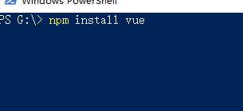

# 第02节：npm常用命令

### 一、安装NPM包

有两种方法安装npm包：本地安装和全局安装，使用哪种安装方式，取决于我们用NPM包做什么

* 如果包作为项目的依赖，需要被引入到项目当中，需要本地安装。
* 如果需要包提供一个命令行工具，则需要全局安装。

#### 本地安装

我们先打开windows命令行工具，进入到需要安装npm包的目录，例如D:/test目录，然后执行下面命令

``` bash
npm install vue
```

效果如下图所示：



安装完成之后，NPM会在D:/test目录下创建一个node_modules的目录，然后将所有NPM包下载到这个目录之下。上面的例子我们下载的是vue，所以打开node_modules会看到一个vue的目录，这就是vue的npm包。

我们可以在test目录下创建js文件，通过require函数引入vue。这部分内容会在下一章深入讲解。

### 全局安装vue依赖

如果我们希望获得NPM包提供的命令，则需要全局安装，全局安装需要在命令中添加-g，示例代码如下所示：

``` bash
npm install -g http-server
```

下载完成之后，http-server包不会像本地安装那样下载到当前目录下，而是会下载到系统目录中，win10系统下载目录如下所示：

> C:\Users\Administrator\AppData\Roaming\npm\node_modules

我们不必去打开这个目录去浏览下载的文件，只要知道如何使用NPM包的命令即可。

例如我们使用刚才下载的http-server包开启一个静态文件目录服务器，步骤如下：

1. 选择开启服务器的目录，这里选择D:/test/server目录。
2. 在这个目录中执行http-server命令，默认端口为8080。
3. 在server目录中创建一个index.html文件。
4. 打开浏览器，访问http://127.0.0.1:8080/index.html，可以看到index.html文件的内容。

以上展示了全局安装http-server包，并通过http-server命令开启一个静态文件目录服务器。后续我们会安装更多的npm全局命令。

### 二、项目初始化

#### 初始化命令

``` bash
npm init
```
在node开发中使用npm init会生成一个pakeage.json文件，这个文件主要是用来记录这个项目的详细信息的，它会将我们在项目开发中所要用到的包，以及项目的详细信息等记录在这个项目中。方便在以后的版本迭代和项目移植的时候会更加的方便。也是防止在后期的项目维护中误删除了一个包导致的项目不能够正常运行。使用npm init初始化项目还有一个好处就是在进行项目传递的时候不需要将项目依赖包一起发送给对方，对方在接受到你的项目之后再执行npm install就可以将项目依赖全部下载到项目里。

#### package.josn文件

* 文件说明
```
package name:                   你的项目名字叫啥  
version:                        版本号  
description:                    对项目的描述  
entry point:                    项目的入口文件（一般你要用那个js文件作为node服务，就填写那个文件）  
test command:                   项目启动的时候要用什么命令来执行脚本文件（默认为node app.js）  
git repository:                 如果你要将项目上传到git中的话，那么就需要填写git的仓库地址（可以不写）  
keywirds：                      项目关键字（可以不写）  
author:                         作者  
license:                        发行项目需要的证书（可以不写）  
```
