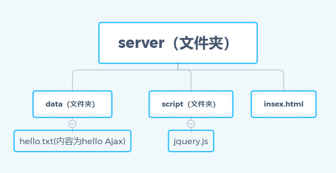

# 第02节：异步交互数据

### 一、Ajax的基本概念

上一节我们已经介绍了http协议，大家有没有发现，案例中我们访问的百度首页的时候，服务器会将整个首页的代码都发给浏览器。也就是说，我们每次向服务器发送请求的时候，都是整个网页刷新，这对于很多场景来说并不适用。


例如上面的截图，在一个教务管理系统中查询学生的信息，整个页面当中只有表格中的数据是变化的，其他内容并没有变化。这样的话我们每次向服务器发送请求都刷新整个页面就会显得有些浪费资源。这时，Ajax就可以发挥作用了。

通过Ajax，我们可以在不刷新整个页面的情况下向服务器发送请求，并获取数据，这样就能实现网页内容的局部刷新，从而减少了数据交互量，提升了软件执行效率。

### 二、jQuery中的ajax方法

Ajax是通过浏览器中的XMLHttpRequest对象实现的，关于这部分内容我们下节会讨论如何使用这个对象，本节我们先使用jQuery实现一个最基本的Ajax功能。

目标是在网页中显示一个按钮，当点击这个按钮的时候，用alert弹出服务器的文本数据，下面我们来实现这个功能。

#### 创建静态服务器

在第六章我们学过http-server了，这里我们还是用它创建一个静态服务器。

``` bash
# 如果没有安装http-server，可以先全局安装
npm install -g http-server
# 在当前目录下启动服务器（例如命令行在D盘的server文件夹下执行，那么D:/server就会变成静态文件服务器目录）
http-server
```

我们在服务器中创建一个data目录用于存放数据，data中添加一个hello.txt的文本文件。然后再server目录下创建一个index.html，并且在项目中添加jQuery，目录结构如下所示：



#### 编码

文件准备就绪之后，先在hello.txt中添加一行文字作为数据，

``` txt
Hello Ajax
```

#### 使用http-server在data文件夹启动一个服务器

``` node.js
http-server
```

#### 使用Ajax获取数据
在html中设置点击按钮获取数据并创建点击事件
``` html
<script>
        $("button").click(function(){//点击执行函数
            //输出data.txt中的数据，hello ajax
            $.ajax({
                type:"get",//请求方法
                url:"http://127.0.0.1:8080/hello.txt"//请求路径，路径为http-server开启的服务器地址
            }).done(function(res){
                alert(res)
            })

        })
</script>
```


### 三、同步与异步概述

我们在回到Ajax的概念上，Ajax（Asynchronous Javascript And XML）的全称是“异步 JavaScript 和 XML”，这个名字有历史遗留问题，大家只要知道“异步”这个词就可以了。

相对于【异步】和【同步】这两个概念，我们之前写的大部分代码都是同步的程序，不管程序是分支语句还是循环语句，都是由上至下的执行（可以理解为在一条直线上执行），如果有行代码出错，整个程序就会被阻塞，后续代码不会继续执行。

【异步】的概念可以理解为程序再两条或多条线上执行，例如第二章中的计时器方法就是一个典型的异步程序。我们回顾一下计时器方法，体验一下异步程序的特点。

``` html
    <script>
        let a = 10;//新建变量a等于10
        let b = 20;//新建变量b等于20
        console.log(a+b);//输出a加b（这是一条异步线）
        
        setTimeout(function(){
            a=a+10;
            console.log(a+b);//输出a加b（这是另一条异步线）
        },1000);
        
        //得出两个值30和40
    </script>

```

### 四、进一步了解异步的程序

``` html
<script>
        // 异步的程序不能通过return返回想要的值
                let a = 10;//新建变量a等于10
                let b = 20;//新建变量b等于20
                console.log(a+b);//输出a加b（这是一条异步线）
                
                setTimeout(function d (){
                    a=a+10;
                    // console.log(a+b);//输出a加b（这是另一条异步线）
                    return true;
                },1000);
                setTimeout(function(){
                    if(this.d==true){
                        //判定return返回的值是不是想要的true
                        console.log('return返回的值')
                    }else{
                        console.log('非return返回的值')
                    };
                },2000);
            </script>
```
### 五、总结

我们已经知道什么是异步交互数据以及异步的特性，下一节我们将不使用任何库或者框架进行异步获取数据。

### 一、同步和异步的理解
同步:发送一个请求,等待返回,然后再发送下一个请求 
异步:发送一个请求,不等待返回,随时可以再发送下一个请求 
 
同步可以避免出现死锁，读脏数据的发生，一般共享某一资源的时候用，如果每个人都有修改权限，同时修改一个文件，有可能使一个人读取另一个人已经删除的内容，就会出错，同步就会按顺序来修改。
异步则是可以提高效率了，现在cpu都是双核，四核，异步处理的话可以同时做多项工作，当然必须保证是可以并发处理的。
这些都是对的。
同步和异步最大的区别就在于。一个需要等待，一个不需要等待。
比如广播，就是一个异步例子。发起者不关心接收者的状态。不需要等待接收者的返回信息
电话，就是一个同步例子。发起者需要等待接收者，接通电话后，通信才开始。需要等待接收者的返回信息

### 二、promise对象的概述
Promise 是异步编程的一种解决方案，比传统的解决方案——回调函数和事件——更合理和更强大。它由社区最早提出和实现，ES2015+ 将其写进了语言标准，统一了用法，原生提供了Promise对象。

所谓Promise，简单说就是一个容器，里面保存着某个未来才会结束的事件（通常是一个异步操作）的结果。从语法上说，Promise 是一个对象，从它可以获取异步操作的消息。Promise 提供统一的 API，各种异步操作都可以用同样的方法进行处理。
#### 基本语法

Promise是ES2015新增加的一个类，我们可以使用new Promise创建一个promise对象。通过promise我们可以让异步的代码更像是同步的代码。我们先看看promise的基本语法：

``` js
const promise = new Promise(function(resolve, reject) {
  // promise

  if (/* 异步操作成功 */){
    resolve(value); // 异步操作成功时调用，把结果作为参数传递出去
  } else {
    reject(error); // 异步失败时调用，把错误作为参数传递出去
  }
});
```

1、因为Promise是一个构造函数，所以我们使用了new操作符来创建promise。

2、构造函数Promise的参数是一个函数（暂时叫它func），这个函数（func）有两个参数resolve和reject，它们分别是两个函数，这两个函数的作用就是将promise的状态从pending（等待）转换为resolved（已解决）或者从pending（等待）转换为rejected（已失败）。

3、创建后的promise有一些方法，then和catch。当然我们也可以人为的在Promise函数上添加一些满足我们自己需求的方法，方便每一个promise对象使用。


#### 实际应用

我们仍然是编写一个person的对象，person有两个属性分别是firstName和age，person有两个方法分别是sayName和sayAge分别会输出自己的名字和年两，但是输出的过程中我们使用延时的方式输出
示例代码如下:[代码案例](https://github.com/xiaozhoulee/xiaozhou-examples/blob/master/04-ES2015%2B/第04节：ES2015（四）/demo02.html)

``` js
var person = {
    firstName: "小明",
    age: 10,
    sayName() {
        setTimeout(() => {
            console.log(this.firstName)
        }, 3000)
    },
    sayAge() {
        setTimeout(() => {
            console.log(this.age)
        }, 2000)
    }
}
person.sayName();
person.sayAge();
```

上面是一段最简单的异步代码，sayName会延时3秒，sayAge会延时两秒，虽然我们先调用了sayName但是因为延时的关系，我们先得到的是age属性，那么在实际开发当中，我们经常会遇到这种异步编程的问题，那么如何实现先输出name，后输出age呢，我们可以用promise来实现这个功能，
代码如下所示:[代码案例](https://github.com/xiaozhoulee/xiaozhou-examples/blob/master/04-ES2015%2B/第04节：ES2015（四）/demo03.html)

``` js
var person = {
    firstName: "小明",
    age: 10,
    sayName() {
        return new Promise((resolve, reject) => {
            setTimeout(() => {
                console.log(this.firstName)
                resolve();
            }, 3000)
        })
    },
    sayAge() {
        return new Promise((resolve, reject) => {
            setTimeout(() => {
                console.log(this.age)
                resolve();
            }, 2000)
        })
    }
}


person.sayName().then(() => {
    person.sayAge();
});
```

我们让sayName和sayAge两个方法都返回一个promise对象，这样在调用sayName之后就可以使用promise的then方法再次调用sayAge,这样当sayName成功执行之后才会执行sayAge，异步的程序就像同步的程序一样，按照我们希望的顺序执行了。


### 三、Symbol概述
ES5 的对象属性名都是字符串，这容易造成属性名的冲突。比如，你使用了一个他人提供的对象，但又想为这个对象添加新的方法（mixin 模式），新方法的名字就有可能与现有方法产生冲突。如果有一种机制，保证每个属性的名字都是独一无二的就好了，这样就从根本上防止属性名的冲突。这就是 ES2015+ 引入Symbol的原因。

ES2015+ 引入了一种新的原始数据类型Symbol，表示独一无二的值。它是 JavaScript 语言的第七种数据类型，前六种是：undefined、null、布尔值（Boolean）、字符串（String）、数值（Number）、对象（Object）。

Symbol 值通过Symbol函数生成。这就是说，对象的属性名现在可以有两种类型，一种是原来就有的字符串，另一种就是新增的 Symbol 类型。凡是属性名属于 Symbol 类型，就都是独一无二的，可以保证不会与其他属性名产生冲突。
示例代码如下:
``` js
let s = Symbol();

typeof s
// "symbol"
```
上面代码中，变量s就是一个独一无二的值。typeof运算符的结果，表明变量s是 Symbol 数据类型，而不是字符串之类的其他类型。

作为属性名的 Symbol
由于每一个 Symbol 值都是不相等的，这意味着 Symbol 值可以作为标识符，用于对象的属性名，就能保证不会出现同名的属性。这对于一个对象由多个模块构成的情况非常有用，能防止某一个键被不小心改写或覆盖。
示例代码如下:

```js
let mySymbol = Symbol();

// 第一种写法
let a = {};
a[mySymbol] = 'Hello!';

// 第二种写法
let a = {
  [mySymbol]: 'Hello!'
};

// 第三种写法
let a = {};
Object.defineProperty(a, mySymbol, { value: 'Hello!' });

// 以上写法都得到同样结果
a[mySymbol] // "Hello!"
```
上面代码通过方括号结构和Object.defineProperty，将对象的属性名指定为一个 Symbol 值。

还有一点需要注意，Symbol 值作为属性名时，该属性还是公开属性，不是私有属性。