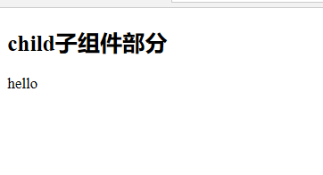
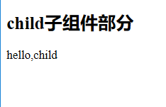
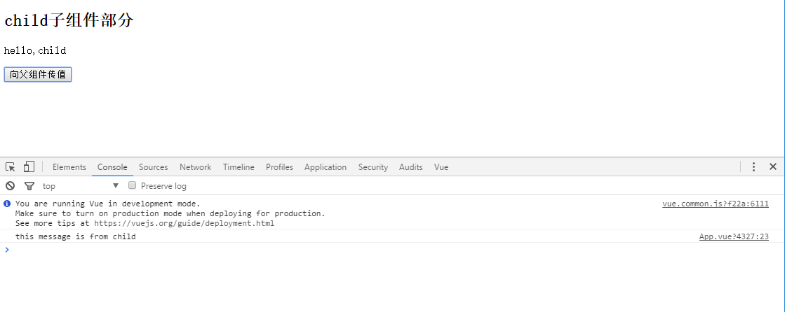

# 第03节：组件传值

### 前言

vue的组件传值分为三种方式：父传子、子传父、非父子组件传值
引用官网的一句话：父子组件的关系可以总结为 prop 向下传递，事件向上传递
父组件通过 prop 给子组件下发数据，子组件通过事件给父组件发送消息，如下图所示：

[案例链接](https://github.com/xiaozhoulee/xiaozhou-examples/tree/master/07-基于Vue的web项目开发/第03节%EF%BC%9A组件传值/组件传值)

### 一、父级向子级传值 
1.创建子组件，在src/components/文件夹下新建一个Child.vue  
2.Child.vue的中创建props，然后创建一个名为message的属性
``` html
<template>
<div>
  <h2>child子组件部分</h2>
  <p>{{message}}</p>
</div>
</template>

<script>
export default {
    props:["message"]
}
</script>
```

3.在App.vue中注册Child组件，并在template中加入child标签，标签中添加message属性并赋值

``` html
<template>
  <div id="app">
<child message="hello"></child>

  </div>
</template>

<script>
import child from './components/Child.vue'
export default {
  name:'app',
  components:{
    child
  }
}
</script>
```

4.保存修改的文件，查看浏览器



5.我们依然可以对message的值进行v-bind动态绑定

``` html
<template>
  <div id="app">
<child v-bind:message="parentMsg"></child>

  </div>
</template>

<script>
import child from './components/Child.vue'
export default {
  name:'app',
  data(){
    return {
      parentMsg:"hello,child"
    }
  },
  components:{
    child
  }
}
</script>
```

此时浏览器中



#### 父组件向子组件传值成功 总结：
```
子组件在props中创建一个属性，用以接收父组件传过来的值  
父组件中注册子组件  
在父组件里面的子组件标签中添加子组件props中创建的属性  
把需要传给子组件的值赋给该属性
```
### 二、子级向父级传值

1.在子组件中创建一个按钮，给按钮绑定一个点击事件
``` html
<template>
<div>
  <h2>child子组件部分</h2>
  <p>{{message}}</p>
  
  <button v-on:click="sendMsgToparent">向父组件传值</button>
</div>
</template>

<script>
export default {
    props:["message"],
    methods:{
      sendMsgToParent:function(){
        
      }
    }
}
</script>
```
2.在响应该点击事件的函数中使用$emit来触发一个自定义事件，并传递一个参数

``` html
<template>
<div>
  <h2>child子组件部分</h2>
  <p>{{message}}</p>
  
  <button v-on:click="sendMsgToparent">向父组件传值</button>
</div>
</template>

<script>
export default {
  props: ["message"],
  methods: {
    sendMsgToParent: function() {
      this.$emit("listenToChildEvent", "this nessage is from child");
    }
  }
};
</script>
```

3.在父组件中的子标签中监听该自定义事件并添加一个响应该事件的处理方法

``` html
<template>
  <div id="app">
<child v-bind:message="parentMsg" v-on:listenToChildEvent="showMsgFromChild"></child>

  </div>
</template>

<script>
import child from './components/Child.vue'
export default {
  name:'app',
  data(){
    return {
      parentMsg:"hello,child"
    }
  },
  methods:{
    showMsgFromChild:function(data){
      console.log(data)
    }
  },
  components:{
    child
  }
}
</script>
```


#### 子组件向父组件传值成功  总结
```
子组件中需要以某种方式例如点击事件的方法来触发一个自定义事件  
将需要传的值作为$emit的第二个参数，该值将作为实参传给响应自定义事件的方法  
在父组件中注册子组件并在子组件标签上绑定对自定义事件的监听  

在通信中，无论是子组件向父组件传值还是父组件向子组件传值，他们都有一个共同点就是有中间介质，子向父的介质是自定义事件，父向子的介质是props中的属性。抓准这两点对于父子通信就好理解了
```
### 三、非父子级组件传值组件传值

在src目录中创建一个bus.js文件，文件内容如下：

``` js
//bus.js
import vue from "vue";
const bus = new vue();
export bus;
```

在上述代码中创建了一个vue实例，命名为bus。

然后我们在两个组件之间，利用这个bus和自定义事件的方式实现组件间的传值。

``` js
// 在传递值的组件中编写如下代码
import bus from "@/bus";

bus.$emit("myevent",value)
```

``` js
// 在接收值的组件中编写如下代码
import bus from "@/bus";

bus.$on("myevent",(data) => {
  console.log(data); //输出传递过来的数据
})
```

#### 水果列表案例

* 创建一个Vue项目，app.vue文件中引入两个组件，一个是表单组件，一个是列表组件。
* 在表单组件中输入水果名称，添加添加按钮提交表单。
* 在列表组件中显示已经添加的水果名称
