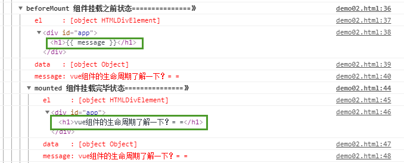
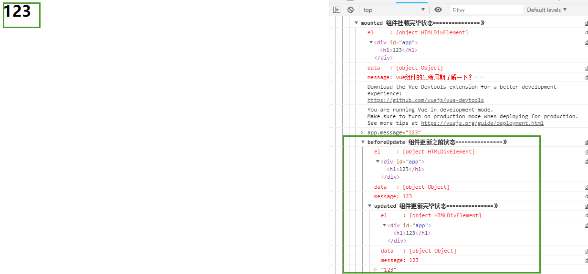
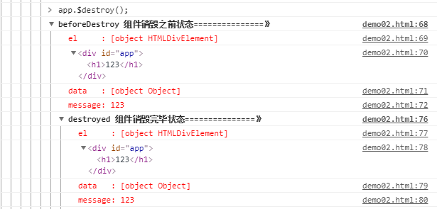
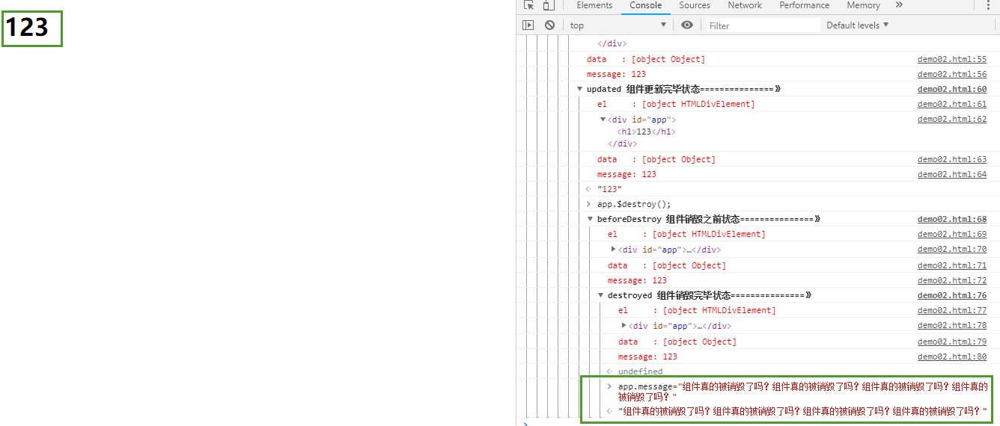

# 第05节：组件的生命周期

### 一、组件的生命周期概念

在使用vue2.0进行日常开发中，我们总有这样的需求，我就想在页面刚一加载出这个表格组件时就发送请求去后台拉取数据，亦或者我想在组件加载前显示个loading图，当组件加载出来就让这个loading图消失等等这样或那样的需求，要实现这些需求，最重要的一点就是我怎么知道这个组件什么时候加载，换句话说我该什么时候向后台发送请求，为了解决这种问题，组件的生命周期钩子函数就应运而生，博主自己作为一个vue2.0的初学者，以自己对vue2.0的组件生命周期的理解，力求以最通俗易懂的语言剖析vue2.0组件生命周期的各个过程，如有理解上的差错，还请大佬们不吝赐教，话不多说，现在开始。

### 二、生命周期图示

#### 首先给出官方文档上的组件生命周期过程图示：

 

这是官方文档给出的一个组件从被创建出来到最后被销毁所要经历的一系列过程，所以这个过程也叫做一个组件的生命周期图。从图中我们可以看到，一个组件从被创建到最后被销毁，总共要经历以下8个过程：

1、beforeCreate:组件创建之前  
2、created：组件创建完毕  
3、beforeMount：组件挂载之前  
4、mounted：组件挂载完毕  
5、beforeUpate：组件更新之前  
6、upated：组件更新完毕  
7、beforeDestoy：组件销毁之前  
8、destoyed：组件销毁完毕  

### 三、代码演示

了解了组件生命周期各个过程后，我们放一波代码，真正的看一看一个组件从生到死到底经历了什么[demo02.html](https://github.com/xiaozhoulee/xiaozhou-examples/blob/master/05-Vue%E5%85%A5%E9%97%A8/%E7%AC%AC05%E7%AB%A0%EF%BC%9A%E8%B4%AD%E7%89%A9%E8%BD%A6%E7%BB%84%E4%BB%B6%E5%8C%96/demo02.html)。

``` html
<body>
<div id="app">
    <h1>{{ message }}</h1>
</div>


<script src="../../script/vue.js"></script>
<script>
    var app = new Vue({
        el: '#app',
        data: {
            message : "vue组件的生命周期了解一下？= ="
        },
        //组件创建之前
        beforeCreate(){
            console.group('beforeCreate 组件创建之前状态===============》');
            console.log("%c%s", "color:red" , "el     : " + this.$el);
            console.log("%c%s", "color:red","data   : " + this.$data);
            console.log("%c%s", "color:red","message: " + this.message)
        },
        //组件创建完毕
        created(){
            console.group('created 组件创建完毕状态===============》');
            console.log("%c%s", "color:red","el     : " + this.$el);
            console.log("%c%s", "color:red","data   : " + this.$data);
            console.log("%c%s", "color:red","message: " + this.message);
        },
        // 组件挂载之前
        beforeMount(){
            console.group('beforeMount 组件挂载之前状态===============》');
            console.log("%c%s", "color:red","el     : " + (this.$el));
            console.log(this.$el);
            console.log("%c%s", "color:red","data   : " + this.$data);
            console.log("%c%s", "color:red","message: " + this.message);
        },
        // 组件挂载完毕
        mounted(){
            console.group('mounted 组件挂载完毕状态===============》');
            console.log("%c%s", "color:red","el     : " + this.$el);
            console.log(this.$el);
            console.log("%c%s", "color:red","data   : " + this.$data);
            console.log("%c%s", "color:red","message: " + this.message);
        },
        // 组件更新之前
        beforeUpdate(){
            console.group('beforeUpdate 组件更新之前状态===============》');
            console.log("%c%s", "color:red","el     : " + this.$el);
            console.log(this.$el);
            console.log("%c%s", "color:red","data   : " + this.$data);
            console.log("%c%s", "color:red","message: " + this.message);
        },
        // 组件更新完毕
        updated(){
            console.group('updated 组件更新完毕状态===============》');
            console.log("%c%s", "color:red","el     : " + this.$el);
            console.log(this.$el);
            console.log("%c%s", "color:red","data   : " + this.$data);
            console.log("%c%s", "color:red","message: " + this.message);
        },
        // 组件销毁之前
        beforeDestroy(){
            console.group('beforeDestroy 组件销毁之前状态===============》');
            console.log("%c%s", "color:red","el     : " + this.$el);
            console.log(this.$el);
            console.log("%c%s", "color:red","data   : " + this.$data);
            console.log("%c%s", "color:red","message: " + this.message);
        },
        // 组件销毁完毕
        destroyed(){
            console.group('destroyed 组件销毁完毕状态===============》');
            console.log("%c%s", "color:red","el     : " + this.$el);
            console.log(this.$el);
            console.log("%c%s", "color:red","data   : " + this.$data);
            console.log("%c%s", "color:red","message: " + this.message)
        }
    })
</script>
</body>
```
运行上面代码，我们在控制台中可以看到：
 

### 四、各个过程详解

#### beforeCreate和created

针对组件创建之前和组件创建完毕这两个过程，我们从控制台打印的结果中可以看出：

在组件创建之前beforeCreate:组件的el和data都未被创建。

在组件创建完毕后created:组件的数据data已经被创建好，但是el还处于未被创建状态。


#### beforeMount和mounted

针对组件挂载之前和组件挂载完毕这两个过程，我们从控制台打印的结果中可以看出：

在组件挂载之前beforeMount:组件的el就会被创建，<label style="color:red">但是值得注意的是：虽然数据data里的message早已经被创建好，但是它还未被应用到真是的DOM元素中。</label>

在组件挂载完毕mounted:组件的el,data都已经全部被创建好，并且data里的message也已经被正确的应用到DOM元素中。


#### beforeUpdate和updated

针对组件更新之前和组件更新完毕这两个过程，我们向控制台中输入以下一行代码：

##### app.message="123"

接着，页面和控制台会变成如下样子：



从图中我们可以看到，当我们将data里的message值改变之后，会触发组件的beforeUpdate和update钩子函数。

####  beforeDestroy和destroyed

针对组件销毁之前和组件销毁完毕这两个过程，我们向控制台中输入以下一行代码：

##### app.$destroy();
某种业务场景下，我们期望缓存的页面可以被销毁，就会调用$destroy方法。  

销毁组件的代码，输入之后并回车，控制台发生了如下变化：



到此之后，整个组件便走完了自己的一生，从创建到被销毁，销毁之后，此时该组件将不再受vue管理，组件上的所有事件监听都会被移除，所以指令都会被解绑。

如若不信，我们再执行以下一行代码，试试再改变一下message的值，看看页面还会不会有什么变化：


从图中我们可以看到，当组件被销毁之后，再怎么对组件进行操作已经全然无用了。  
### 总结
以上就是vue中组件生命周期钩子函数执行的各个过程以及执行的时机，但是这些钩子函数到底该怎么用呢？针对前面概念中提出的需求我们又该怎么解决呢？在这里，给大家举个例子：

<table><tr><td bgcolor=#fceeee>

例如有一个表格组件：

1.我们想在表格加载之前显示个loading图，那么我们可以在组件创建之前的钩子函数beforeCreate里面将loading图显示。

2.当组件加载出来，我们可以在created钩子函数里让这个loading图消失。

3.当表格被加载好之后我们想让它马上去拉取后台数据，那么我们可以在组件挂载之前的钩子函数beforeMount里面去发送请求。
</td></tr></table>

#### 课后练习

1. 实现一个图片列表，点击数字会切换图片，并且在页面加载后每个1秒自动切换一张图片。