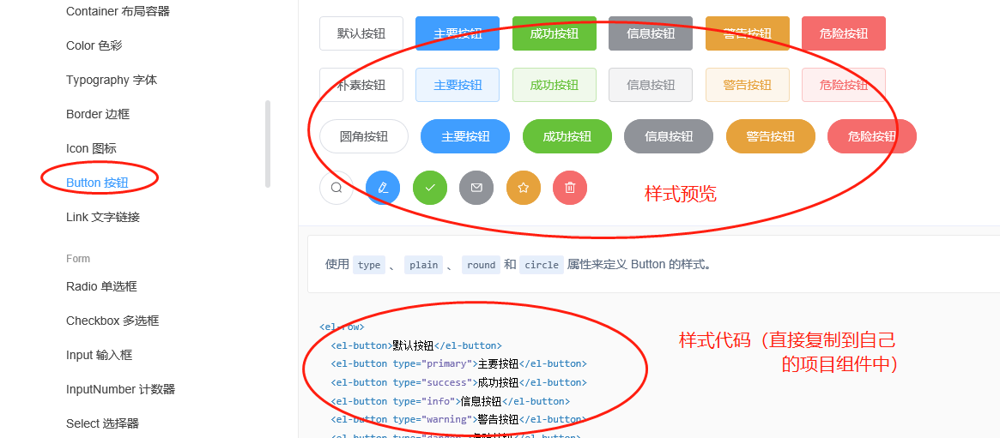

# 第 06 节：elementUI

### 一、element-ui 简介

我们学习VUE,知道它的核心思想式组件和数据驱动,但是每一个组件都需要自己编写模板,样式,添加事件,数据等是非常麻烦的,所以饿了吗推出了基于VUE2.0的组件库,提供现成的PC端组件.  
这个组件库的名称叫做element-ui,基于Vue2.0开发,提供了丰富的PC端组件
Element-UI 一套为开发者、设计师和产品经理准备的基于 Vue 2.0 的桌面端组件库  
官方文档地址： [http://element-cn.eleme.io/#/zh-CN/component/installation)

### 二、安装 elementUI

推荐使用 npm 的方式安装，它能更好地和 webpack 打包工具配合使用。  
在项目的根目录打开命令行输入：

```
npm i element-ui -S
```

### 三、elementUI 的组件示例
[案例链接](https://github.com/xiaozhoulee/xiaozhou-examples/tree/master/07-基于Vue的web项目开发/第05节%EF%BC%9Aelement/组件示例
)  
首先在项目的 main.js 中配置以下内容（main.js 文件在项目的根目录）：

```js
import Vue from "vue";
import App from "./App.vue";
import ElementUI from "element-ui";
import "element-ui/lib/theme-chalk/index.css";

Vue.use(ElementUI);

new Vue({
  el: "#app",
  render: h => h(App)
});
```

必须配置以后才能实现想要的效果

 [Element 组件链接链](https://element.eleme.cn/#/zh-CN/component/icon)



在 Element 官方组件里找到想要的样式，拷贝进自己的项目组件中
```html
<template>
  <el-row>
    <el-button>默认按钮</el-button>
    <el-button type="primary">主要按钮</el-button>
    <el-button type="success">成功按钮</el-button>
    <el-button type="info">信息按钮</el-button>
    <el-button type="warning">警告按钮</el-button>
    <el-button type="danger">危险按钮</el-button>
  </el-row>

  <el-row>
    <el-button plain>朴素按钮</el-button>
    <el-button type="primary" plain>主要按钮</el-button>
    <el-button type="success" plain>成功按钮</el-button>
    <el-button type="info" plain>信息按钮</el-button>
    <el-button type="warning" plain>警告按钮</el-button>
    <el-button type="danger" plain>危险按钮</el-button>
  </el-row>

  <el-row>
    <el-button round>圆角按钮</el-button>
    <el-button type="primary" round>主要按钮</el-button>
    <el-button type="success" round>成功按钮</el-button>
    <el-button type="info" round>信息按钮</el-button>
    <el-button type="warning" round>警告按钮</el-button>
    <el-button type="danger" round>危险按钮</el-button>
  </el-row>

  <el-row>
    <el-button icon="el-icon-search" circle></el-button>
    <el-button type="primary" icon="el-icon-edit" circle></el-button>
    <el-button type="success" icon="el-icon-check" circle></el-button>
    <el-button type="info" icon="el-icon-message" circle></el-button>
    <el-button type="warning" icon="el-icon-star-off" circle></el-button>
    <el-button type="danger" icon="el-icon-delete" circle></el-button>
  </el-row>
</template>
```

第三步:展示完成效果


### 四、学生列表
下面是vue+elementUI写的一个学生列表，可以当作一个参考  
[案例参考](https://github.com/xiaozhoulee/xiaozhou-examples/tree/master/07-基于Vue的web项目开发/第05节%EF%BC%9Aelement/学生列表
)

### 五、课后练习

1. 使用element-ui完成一个学生列表的添加和删除功能。
2. 使用element-ui完成一个学生列表单选删除和全选删除功能