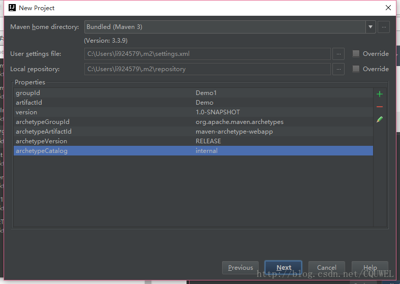
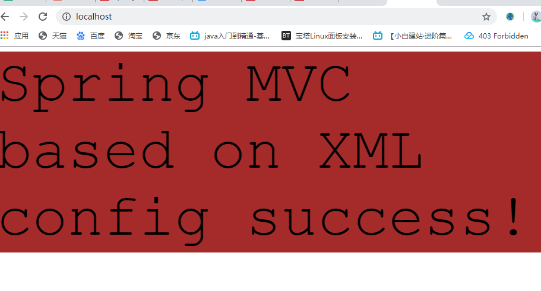

# 第03节:maven管理SpringMVC项目

<<<<<<< HEAD
上一章学了maven，那本节就来实现maven管理SpringMVC项目吧。

=======
>>>>>>> liaofeng
### 一、为什么要使用maven来管理SpringMVC项目？

* 通过maven这个代码管理工具，可以随时添加SpringMVC的依赖。以后深入开发中会发现方便很多。
* 在你web项目已经运行的时候，修改代码的能直接被web服务器所应用，就不需要你 重启服务器了，或者重新部署代码了，可以说是支持热部署，很方便。
* 而且当你项目完成后可以直接通过maven 打包war或者jar项目，也可以说是支持热编译，这一点在第十三章中有过介绍。

### 二、IDEA创建webapp原型的maven项目

利用Maven创建项目可以基于现有的模型创建，比如我们创建时选择 maven-archetype-webapp ，这样可以省去很多项目创建过程，就可以快速创建普通的web项目。  

新建一个maven project，并且选择webapp原型。  

<<<<<<< HEAD
  

然后点击next  

  

这里的GroupId和ArtifactID随意填写，ArtifactId是项目名称，GroupId一般写项目网址的倒叙，例如com.xiaozhoubg  

  
=======
  

然后点击next  

  

这里的GroupId和ArtifactID随意填写，ArtifactId是项目名称，GroupId一般写项目网址的倒叙，例如com.xiaozhoubg  

  
>>>>>>> liaofeng

为了快一点创建，我们添加一个属性值，如图中亮的所示，点右边的加号，**name=archetypeCatalog value=internal**。当然也可以不添加属性值，只不过项目开始时下载的依赖会慢一点。  

为了之后能够快速的下载依赖包，我们要加一个官方库的镜像，因为maven的官方仓库在国外，太慢了。  
idea的maven一开始是没有setting.xml的，所以你要去maven的目录里面拷一份setting.xml到你的仓库中。  
idea的maven在安装路径的plugins文件夹下，例如我的C:\Program Files\JetBrains\IntelliJ IDEA 2019.2.4\plugins\maven\lib\maven3\conf拷贝到你的用户文件夹下的.m2文件夹下。  

在你的.m2文件夹下的setting.xml中添加如下代码即可：  

``` xml
<mirror>
    <id>alimaven</id>
    <mirrorOf>central</mirrorOf>
    <name>aliyun maven</name>
   <url>http://maven.aliyun.com/nexus/content/repositories/central/</url>
</mirror>
```

具体位置如下图所示:  
<<<<<<< HEAD
  
这个是阿里的库，所以很快。做完之后我们回到idea，点击next，然后填写项目名，然后finish。  
接下来idea开始创建项目，这里你要把maven自动导入打开。  
  
=======
  
这个是阿里的库，所以很快。做完之后我们回到idea，点击next，然后填写项目名，然后finish。  
接下来idea开始创建项目，这里你要把maven自动导入打开。  
  
>>>>>>> liaofeng

等待导入完成...  
这样我们的项目初始的框架就弄好了。  

<<<<<<< HEAD
### 三、目录结构完善

1. 首先我们在src/main文件夹下创建java文件夹和resources文件夹，你会发现右击这个文件夹不能创建java的类文件和package，别急，先把必须的文件夹全部创建好。请按照下图创建文件夹  

  

2. 右键点击如图  

  

> 将java标记为Sources Root
> 将resources标记为Resources Root

3. 继续完善目录

  

* 标记为Sources Root的意思是将java文件夹标记为源文件夹，所有的类都写在这里
* 标记为Resources Root的意思是标记为配置文件，后续会在该文件里面编写SpringMVC的配置文件
* 很多文件都是我们自行创建的，并不是创建项目就自带的
  
### 四、添加pom依赖

我们打开其中的pom.xml，添加我们的依赖。这里我把我的依赖全部放出来，覆盖到你的pom.xml的**dependencies**标签之间并且在**properties**标签添加版本代码就可以了，pom文件中也会给你一个示例。  
=======
### 三、添加pom依赖

我们打开其中的pom.xml，添加我们的依赖。这里我把我的依赖全部放出来，复制到你的pom.xml的**dependencies**标签之间就可以了，pom文件中也会给你一个示例。  
>>>>>>> liaofeng

我的依赖如下  

``` xml
<<<<<<< HEAD
<!-- properties标签中添加👇 -->
<!-- 定义spring依赖的版本 -->
    <spring.version>5.0.2.RELEASE</spring.version>

<!-- dependencies标签中添加👇 -->
<!-- 添加spring依赖 -->
    <dependency>
      <groupId>org.springframework</groupId>
      <artifactId>spring-context</artifactId>
      <version>${spring.version}</version>
    </dependency>
    <dependency>
      <groupId>org.springframework</groupId>
      <artifactId>spring-web</artifactId>
      <version>${spring.version}</version>
=======
<!--测试-->
    <dependency>
      <groupId>junit</groupId>
      <artifactId>junit</artifactId>
      <version>4.12</version>
      <scope>test</scope>
    </dependency>
    <!--日志-->
    <dependency>
      <groupId>org.slf4j</groupId>
      <artifactId>slf4j-log4j12</artifactId>
      <version>1.7.21</version>
    </dependency>
    <!--J2EE-->
    <dependency>
      <groupId>javax.servlet</groupId>
      <artifactId>javax.servlet-api</artifactId>
      <version>3.1.0</version>
    </dependency>
    <dependency>
      <groupId>javax.servlet.jsp</groupId>
      <artifactId>jsp-api</artifactId>
      <version>2.2</version>
    </dependency>
    <dependency>
      <groupId>javax.servlet</groupId>
      <artifactId>jstl</artifactId>
      <version>1.2</version>
    </dependency>
    <!--mysql驱动包-->
    <dependency>
      <groupId>mysql</groupId>
      <artifactId>mysql-connector-java</artifactId>
      <version>5.1.35</version>
    </dependency>
    <!--springframework-->
    <dependency>
      <groupId>org.springframework</groupId>
      <artifactId>spring-web</artifactId>
      <version>4.2.6.RELEASE</version>
>>>>>>> liaofeng
    </dependency>
    <dependency>
      <groupId>org.springframework</groupId>
      <artifactId>spring-webmvc</artifactId>
<<<<<<< HEAD
      <version>${spring.version}</version>
    </dependency>
    <dependency>
      <groupId>javax.servlet</groupId>
      <artifactId>servlet-api</artifactId>
      <version>2.5</version>
      <scope>provided</scope>
    </dependency>
    <dependency>
      <groupId>javax.servlet.jsp</groupId>
      <artifactId>jsp-api</artifactId>
      <version>2.0</version>
      <scope>provided</scope>
=======
      <version>4.2.6.RELEASE</version>
    </dependency>
    <dependency>
      <groupId>org.springframework</groupId>
      <artifactId>spring-context</artifactId>
      <version>4.2.6.RELEASE</version>
    </dependency>
    <dependency>
      <groupId>org.springframework</groupId>
      <artifactId>spring-test</artifactId>
      <version>4.2.6.RELEASE</version>
    </dependency>
      <dependency>
          <groupId>org.springframework</groupId>
          <artifactId>spring-jdbc</artifactId>
          <version>4.2.6.RELEASE</version>
      </dependency>
    <dependency>
      <groupId>com.github.stefanbirkner</groupId>
      <artifactId>system-rules</artifactId>
      <version>1.16.1</version>
      <scope>test</scope>
    </dependency>
    <dependency>
      <groupId>org.aspectj</groupId>
      <artifactId>aspectjweaver</artifactId>
      <version>1.8.9</version>
    </dependency>
    <!--其他需要的包-->
    <dependency>
        <groupId>org.apache.commons</groupId>
        <artifactId>commons-lang3</artifactId>
        <version>3.4</version>
    </dependency>
    <dependency>
        <groupId>commons-fileupload</groupId>
        <artifactId>commons-fileupload</artifactId>
        <version>1.3.1</version>
>>>>>>> liaofeng
    </dependency>
```

一旦你复制过去之后，maven就会开始下载相应的jar文件，等待下载完成即可。可能包有点多，不过用了阿里的镜像之后还是挺快的。  

<<<<<<< HEAD
### 五、基于XML的配置

完善目录结构并且配置pom之后就在床架的目录中写下如下代码

#### 1、配置核心的控制器

1 在web.xml的web-app标签中配置文件中核心控制器DispatcherServlet

``` xml
<!-- SpringMVC的核心控制器 -->
  <servlet>
  <servlet-name>dispatcherServlet</servlet-name>
  <servlet-class>org.springframework.web.servlet.DispatcherServlet</servlet-class>
  <!-- 配置Servlet的初始化参数，读取springmvc的配置文件，创建spring容器 -->
  <init-param>
    <param-name>contextConfigLocation</param-name>
    <param-value>classpath:springmvc.xml</param-value>
  </init-param>
    <!-- 配置servlet启动时加载对象 -->
    <load-on-startup>1</load-on-startup>
  </servlet>
  <servlet-mapping>
    <servlet-name>dispatcherServlet</servlet-name>
    <url-pattern>/</url-pattern>
  </servlet-mapping>
=======
### 四、添加框架支持

配置完pom.xml之后，我们在idea中要添加一下框架的支持。  
右击我们的项目文件夹，选择add framework support  
  
然后在窗口中分别选中spring和springmvc，记得勾选springconfig.xml。  

  

* 这里有一个注意点！如果add framework support选项中没有springmvc选项是因为创建项目的时候，
  项目本身自带了springmvc的配置，但是项目中自带的springmvc并不齐全,所以说我们要先删除项目
  中的springmvc再重新在add framework support中配，具体如何删除，请看下图指示。

  

这时候add framework support选项中才会出现springmvc  

接下来点击ok之后，我们会发现WEB-INF文件夹下多出了两个文件。  

  

这两个文件就是我们之后要配置的文件，先不用管。  

### 五、完善目录结构

框架支持至此就添加完成！下一步是完善目录结构。

首先我们在src/main文件夹下创建java文件夹，你会发现这个文件夹不能创建java的类文件和package，别急，先把必须的文件夹全部创建好。请按照下图创建文件夹  

  

然后我们进入project structure选择文件夹的作用，在界面的右上角进入project structure  
  

然后在module中选择设置各个模块，其中java文件夹是 sources，改完之后，点ok，文件夹会变蓝色，那就成功了。  
然后java文件夹中添加需要的包。最后的完整目录如下  
  

* Java里面写控制器代码
* statics里面放静态文件
* view里面放视图

### 六、基于XML 的配置

完善目录结构之后就在床架的目录中写下如下代码

#### 1、配置web.xml

idea创建的web.xml这个文件版本比较低，所以我们要找一个新的。把我的文件直接全部覆盖复制进去就可以了。  

``` xml
<?xml version="1.0" encoding="UTF-8"?>
<web-app xmlns="http://xmlns.jcp.org/xml/ns/javaee"
         xmlns:xsi="http://www.w3.org/2001/XMLSchema-instance"
         xsi:schemaLocation="http://xmlns.jcp.org/xml/ns/javaee http://xmlns.jcp.org/xml/ns/javaee/web-app_3_1.xsd"
         version="3.1">

    <display-name>Archetype Created Web Application</display-name>

    <!--welcome pages-->
    <welcome-file-list>
        <welcome-file>index.jsp</welcome-file>
    </welcome-file-list>

    <!--配置springmvc DispatcherServlet-->
    <servlet>
        <servlet-name>springMVC</servlet-name>
        <servlet-class>org.springframework.web.servlet.DispatcherServlet</servlet-class>
        <init-param>
            <!--配置dispatcher.xml作为mvc的配置文件-->
            <param-name>contextConfigLocation</param-name>
            <param-value>/WEB-INF/dispatcher-servlet.xml</param-value>
        </init-param>
        <load-on-startup>1</load-on-startup>
        <async-supported>true</async-supported>
    </servlet>
    <servlet-mapping>
        <servlet-name>springMVC</servlet-name>
        <url-pattern>/</url-pattern>
    </servlet-mapping>
    <!--把applicationContext.xml加入到配置文件中-->
    <context-param>
        <param-name>contextConfigLocation</param-name>
        <param-value>/WEB-INF/applicationContext.xml</param-value>
    </context-param>
    <listener>
        <listener-class>org.springframework.web.context.ContextLoaderListener</listener-class>
    </listener>
</web-app>
>>>>>>> liaofeng
```

上面代码的意思主要就是创建一个中央的控制器，每一个模块都有简单的注释，假如有需要，可以自行百度。  

<<<<<<< HEAD
#### 2、springmvc.xml配置文件编写
=======
#### 2、配置dispatcher-servlet.xml
>>>>>>> liaofeng

这个文件负责mvc的配置。

* 之前概念中介绍过MVC，这里再简单提醒一下:MVC全名是Model View Controller，是模型(model)－视图(view)－控制器(controller)的缩写也就意味着其中包含着模型，视图，控制器的内容。

<<<<<<< HEAD
首先在我们之前创建好的resources配置文件夹中创建springmvc配置文件，如图


``` xml
<?xml version="1.0" encoding="UTF-8"?>
<beans xmlns="http://www.springframework.org/schema/beans"
       xmlns:mvc="http://www.springframework.org/schema/mvc"
       xmlns:context="http://www.springframework.org/schema/context"
       xmlns:xsi="http://www.w3.org/2001/XMLSchema-instance"
       xsi:schemaLocation="
http://www.springframework.org/schema/beans
http://www.springframework.org/schema/beans/spring-beans.xsd
http://www.springframework.org/schema/mvc
http://www.springframework.org/schema/mvc/spring-mvc.xsd
http://www.springframework.org/schema/context
http://www.springframework.org/schema/context/spring-context.xsd">
    <!-- 配置spring创建容器时要扫描的包，自动扫描com.xiaozhoubg文件夹下的Controller文件-->
    <context:component-scan base-package="com.xiaozhoubg"></context:component-scan>
    <!-- 配置视图解析器 -->
    <bean id="viewResolver"
          class="org.springframework.web.servlet.view.InternalResourceViewResolver">
          <!-- 解析地址 -->
        <property name="prefix" value="/WEB-INF/pages/"></property>
        <!-- 解析格式(.jsp) -->
        <property name="suffix" value=".jsp"></property>
    </bean>
    <!-- 配置spring开启注解mvc的支持-->
    <mvc:annotation-driven></mvc:annotation-driven>
</beans>

```

直接复制即可，最后的总结中会具体总结。 

### 六、controller和index配置并启动项目

1. 配置文件配置好之后，就可以测试了。首先编写index.jsp文件。

``` jsp
<%@ page contentType="text/html;charset=UTF-8" language="java" %>
<html>
<head>
    <title>Title</title>
</head>
<body>
<h3>index.jsp页面</h3>
<a href="/hello">跳转</a>
<!-- a标签的跳转会指向ControllerTest01控制器 -->
=======
``` xml
<?xml version="1.0" encoding="UTF-8"?>
<beans xmlns="http://www.springframework.org/schema/beans"
       xmlns:xsi="http://www.w3.org/2001/XMLSchema-instance"
       xmlns:context="http://www.springframework.org/schema/context"
       xmlns:mvc="http://www.springframework.org/schema/mvc"
       xsi:schemaLocation="http://www.springframework.org/schema/beans http://www.springframework.org/schema/beans/spring-beans.xsd http://www.springframework.org/schema/context http://www.springframework.org/schema/context/spring-context.xsd http://www.springframework.org/schema/mvc http://www.springframework.org/schema/mvc/spring-mvc.xsd">
    <!--此文件负责整个mvc中的配置-->

    <!--启用spring的一些annotation -->
    <context:annotation-config/>

    <!-- 配置注解驱动 可以将request参数与绑定到controller参数上 -->
    <mvc:annotation-driven/>

    <!--静态资源映射-->
    <!--把静态资源放在webapp的statics目录下，资源映射如下-->
    <!--但是本项目目前并不需要静态资源，所以之前我们创建目录中并没有创建-->
    <mvc:resources mapping="/css/**" location="/WEB-INF/statics/css/"/>
    <mvc:resources mapping="/js/**" location="/WEB-INF/statics/js/"/>
    <mvc:resources mapping="/image/**" location="/WEB-INF/statics/image/"/>

    <!-- 对模型视图名称的解析，即在模型视图名称添加前后缀(如果最后一个还是表示文件夹,则最后的斜杠不要漏了) 使用JSP-->
    <!-- 默认的视图解析器 在上边的解析错误时使用 (默认使用html)- -->
    <bean id="defaultViewResolver" class="org.springframework.web.servlet.view.InternalResourceViewResolver">
        <property name="viewClass" value="org.springframework.web.servlet.view.JstlView"/>
        <property name="prefix" value="/WEB-INF/view/"/><!--设置JSP文件的目录位置-->
        <property name="suffix" value=".jsp"/>
        <property name="exposeContextBeansAsAttributes" value="true"/>
    </bean>

    <!-- 自动扫描装配 -->
    <context:component-scan base-package="example.controller"/>
</beans>
```

直接复制即可，都有注释，如果有需要，请自行百度。  

#### 3、 配置applicationContext.xml  

其实这个文件没什么好配置的，这个文件主要负责一些非mvc组件（其他组件）的配置，咱们学的是MVC暂时没有其他组件，所以是空的，但你也可以扫描一下。

``` xml
<?xml version="1.0" encoding="UTF-8"?>
<beans xmlns="http://www.springframework.org/schema/beans"
       xmlns:xsi="http://www.w3.org/2001/XMLSchema-instance"
       xmlns:context="http://www.springframework.org/schema/context"
       xsi:schemaLocation="http://www.springframework.org/schema/beans http://www.springframework.org/schema/beans/spring-beans.xsd http://www.springframework.org/schema/context http://www.springframework.org/schema/context/spring-context.xsd">
    <context:component-scan base-package="example"/>
</beans>
```

#### 七、入门案例测试

三个配置文件配置好之后，就可以测试了。首先在controller文件夹下创建一个IndexController，代码如下：

``` java
@Controller
@RequestMapping("/home")
public class IndexController {

    @RequestMapping("/index")
    public String index() {
        //return的是视图模板文件
        return "index";
    }
}
```

views文件夹下创建index.jsp，statics/css/下创建test.

``` xml
<%@ taglib prefix="c" uri="http://java.sun.com/jsp/jstl/core" %>
<%@ page contentType="text/html;charset=UTF-8" language="java" %>
<html>
<head>
    <title>Index</title>
    <link rel="stylesheet" type="text/css" href="<c:url value="/css/test.css"/> "/>
</head>
<body>
<p>Spring MVC based on XML config success!</p>
>>>>>>> liaofeng
</body>
</html>
```

<<<<<<< HEAD
2. 接下来在controller文件夹下创建一个ControllerTest01类，代码如下：

``` java
package com.xiaozhoubg;

import org.springframework.stereotype.Controller;
import org.springframework.web.bind.annotation.RequestMapping;

//控制器类
// 注解声明了这是Controller文件，接受自动扫描包
@Controller
public class ControllerTest01 {
    //注解写法可以在mvc中使用，定义触发本方法的路径，与index.jsp中的a标签相同
    @RequestMapping(path = "/hello")
    public String test01(){
        System.out.println("hello");
        return "success";
        // return的值因为配置了视图注解器，所以会返回jsp文件
    }
}

```

3. 在pages中编写success.jsp文件，内容自拟

接下来配置tomcat启动服务器后启动tomcat。
  
点击跳转链接会跳转到success.jsp文件，并且在idea控制台中打印"hello"

至此springMVC成功入门

### 七、入门例的执行过程分析

#### 执行流程
=======
``` css
p{
    background-color: brown;
    font-family: "Courier New";
    font-size:100px;
}
```

接下来配置tomcat启动服务器后启动tomcat。
  
至此成功创建SpingMVC项目

### 八、入门案例的执行过程分析
>>>>>>> liaofeng

  1. 当启动Tomcat服务器的时候，因为配置了load-on-startup标签，所以会创建DispatcherServlet对象，
就会加载springmvc.xml配置文件

  2. 开启了注解扫描，那么HelloController对象就会被创建

  3. 从index.jsp发送请求，请求会先到达DispatcherServlet核心控制器，根据配置@RequestMapping注解
找到执行的具体方法

  4. 根据执行方法的返回值，再根据配置的视图解析器，去指定的目录下查找指定名称的JSP文件
  
  5. Tomcat服务器渲染页面，做出响应

<<<<<<< HEAD
#### 应用到的组件

* DispatcherServlet：前端控制器
用户请求到达前端控制器，它就相当于mvc模式中的c，dispatcherServlet是整个流程控制的中心，由它调用其它组件处理用户的请求，dispatcherServlet的存在降低了组件之间的耦合性。

* HandlerMapping：处理器映射器
HandlerMapping负责根据用户请求找到Handler即处理器，springmvc提供了不同的映射器实现不同的映射方式，例如：配置文件方式，实现接口方式，注解方式等。

* Handler：处理器
Handler 是继DispatcherServlet前端控制器的后端控制器，在DispatcherServlet的控制下Handler对具体的用户请求进行处理。由于Handler涉及到具体的用户业务请求，所以一般情况需要程序员根据业务需求开发Handler。

* HandlAdapter：处理器适配器
通过HandlerAdapter对处理器进行执行，这是适配器模式的应用，通过扩展适配器可以对更多类型的处理器进行执行。

* View Resolver：视图解析器
View Resolver负责将处理结果生成View视图，View Resolver首先根据逻辑视图名解析成物理视图名即具体的页面地址，再生成View视图对象，最后对View进行渲染将处理结果通过页面展示给用户。

* View：视图
springmvc框架提供了很多的View视图类型的支持，包括：jstlView、freemarkerView、pdfView等。我们最常用的视图就是jsp。一般情况下需要通过页面标签或页面模版技术将模型数据通过页面展示给用户，需要由程序员根据业务需求开发具体的页面。

### 八、总结及作业

> 作业：本节学完后请同学们多创建配置几个maven管理SpringMVC项目  

[本节创建项目的源码](https://github.com/xiaozhoulee/java-examples/tree/master/14-spring_mvc/%E7%AC%AC02%E8%8A%82%EF%BC%9Amaven%E7%AE%A1%E7%90%86springMVC/springmvc01)

<!-- 项目启动首先执行web.xml组件，web.xml组件调用配置文件夹中的springmvc配置文件。
项目开启后显示index.jsp页面，跳传到ControllerTest01控制器，返回success.jsp。 -->

**完成作业后会让自己对创建这个项目有个大概的流程思维，这时回过头去再看第七条，就非常好理解项目的执行过程了。**
以上就是 maven管理SpringMVC项目的写法了。  

**(之前我们在第十二章servlet中使用并讲解过@WebServlet注解和@WebFilter注解)**  
@RequestMapping注解是作用在SpringMVC中的，在本章之后的知识中会不断地使用@RequestMapping注解，并且会有注释进行解释，然后会在第X节做一个@RequestMapping注解总结，帮助大家更系统性的了解@RequestMapping注解。
=======
### 九、总结及作业

> 作业：本节学完后请同学们多创建配置几个maven管理SpringMVC项目  

**完成作业后会让自己对创建这个项目有个大概的流程思维，这时回过头去再看第八条，就非常好理解项目的执行过程了。**
以上就是 maven管理SpringMVC项目的写法了。  
下一节我们来学习spring中的控制器。  
>>>>>>> liaofeng
