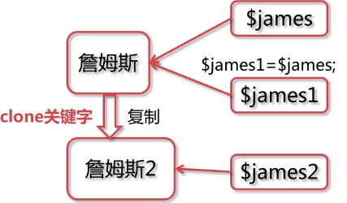

# 第13节:面向对象
上一节我们介绍了命名空间的定义及使用方式，本节讲解的是php中面向对象的概念、思路及原则以及面向对象的三大特征：继承、封装与多态

### 一、学习目标
面向对象的概念可以分成哪些部分，及如何定义一个class类和怎么回收不利用的资源，以及学习面向对象的三大特征和抽象类的理解，了解面向对象的四种魔术方法

### 二、面向对象的概念
#### 1.什么是面向对象(object oriented)
世间万物皆对象，抽象的也是对象，一切可见或不可见都是对象

#### 2.对象的基本组成
对象包含两个部分：

- 对象的组成元素：
  是对象的数据模型，用于描述对象的数据
  又称为对象的属性，或者对象的成员变量

* 对象的行为：
  是对象的行为模型，用于描述对象能够做什么事情
  又被称为对象的方法

#### 3.对象特点
* 每一个对象都是独一无二的
* 对象是一个特定的事物，他的职能是完成特定功能
* 对象是可以重复使用的

#### 4.面向对象简介
1.面向对象编程
就是编程的时候数据结构（数据组织方式 ）都通过对象的结构进行存储，使用属性和方法组织起来
2.为什么要使用面向对象编程？
对象的描述方式更加贴合真实世界，有利于对大型业务的理解

#### 5.面向对象的实质
1.面向对象就是把生活中要解决的问题都用对象的方式进行存储--把所有的数据用属性、方法表现出来。
2.对象之间的互动是通过方法的调用完成互动

#### 6.面向对象的基本思路
1.识别对象
任何实体都可以被识别为一个对象
2.识别对象的属性
对象里面存储的数据被识别为属性
对于不同的业务逻辑，关注的数据不同，对象里面存储的属性也不同
3.识别对象的行为
对象自己的属性数据的改变
对象外部的交互

#### 7.面向对象的基本原则
1.对象内部高内聚
对象只负责一项特定的职能（职能可大可小）
所有对象相关的内容都封装到对象内部
2.对象外部低耦合
外部世界可以看到对象的一些属性（并非全部）
外部世界可以看到对象可以做某些事情（并非全部）

注意:软件设计尽可能的做到：高内聚，低耦合，模块与模块间应该是独立的，没有依赖关系

### 三、面向对象的基本实践
#### 1.类的概念
1.物以类聚，把具有相似特性的对象对垒到一个类中
2.类定义了这些相似对象拥有相同的属性和方法
3.类是相似对象的描述，成为类的定义，是该类对象的蓝图或者原型
4.类的对象称为一个类的实例
5.类的属性和方法统称为类成员

#### 2.类的实例化
1.类的实例化：通过类定义创建一个类的对象
2.类的定义属性值都是空或默认值，而对象的属性都有具体的值

#### 3.类的定义
1.类的定义以关键字class开始，后面跟着这个类的名称。类的命名通常每个单词的第一个字母大写，以中括号开始和结束
2.类的实例化为对象时使用关键字new，new之后紧跟类的名称和一对括号
3.对象中的成员属性和方法可以通过->符号来访问

#### 4.构造函数
1.默认构造函数在对象被实例化的时候自动调用
2.\$this是php里面的伪变量，表示对象本身。可以通过\$this->的方式访问对象的属性和方法
3.每一次用new实例化对象的时候，都会用类名后面的参数列表调用构造函数
4.php类函数的构造函数function __construct(){}运行时自动调用

#### 5.析构函数
1.function __destruct(){}析构函数是根据后入先出的原则
2.有两种方式会被执行析构函数：对象被设置未null或者程序结束时会被自动调用析构函数，，所占用的资源被系统回收
3.析构函数通常被用于清理程序使用的资源，比如释放打开的文件等等
4.析构函数在该对象不会再被使用的情况下自动调用，如果被复制了，而不是&引用，就不会调用析构函数

#### 6.对象&引用的基本概念
``` php
$james1 = $james; //相当于复制出来多一个引用，两者是独立的两个引用
$james2 = &$james; //相当于为james取一个别名，两者其实是一体的，只是有两个名字
```


特别注意：
1.PHP 永远会将对象按引用传递（ArrayObject 是一个SPL对象，它完全模仿数组的用法，但是却是以对象来工作）
2.\$arr = array(); \$arr2 = \$arr; \$arr2是\$arr数组的一份拷贝，它们之间互不影响，是独立的两个数组
3.&对象（数组）都是相当于起别名

### 三、面向对象的高级实战
#### 1.对象的继承
父类：拥有部分相同的属性和方法

继承的好处

* 父类里面定义的类成员可以不用在子类中重复定义，节约了编程的时间和代价
* 同一个父类的子类拥有相同父类定义的类成员，因此外部代码调用他们的时候可以一视同仁
* 子类可以修改和调用父类定义的类成员
我们称为重写（Overwrite）
一旦子类修改了，就按照子类修改之后的功能执行

子类：

* 子类可以通过$this访问父类的属性
* 子类的对象可以直接调用父类的方法和属性
* PHP的单继承特性：类不允许同时继承多个父类（extends后面只能跟一个父类名称）

#### 2.访问控制
面向对象的三种访问权限：
* public是公有的类成员，可以在任何地方被访问，
可以被类、子类或者对象访问
* protected受保护的类成员，可以被其自身以及继承的子类访问
可以被子类继承，但是不能被对象访问，只能通过封装的方式让对象访问
* private私有的类成员，只能被自身访问
不能被子类继承，也不能被对象访问，只能在自身通过封装让外界访问（例如：在类里面定义一个公开方法来调用私有属性）

#### 3.Static(静态)关键字
静态成员：定义时在访问控制关键字后添加static关键字即可（创建静态关键字：public. protected. private）
* 静态属性用于保存类的公有数据，可以在不同对象间共享
* 静态方法里面只能访问静态属性
* 静态成员不需要实例化对象就可以访问
* 类的内部可以通过 self:: 或 static:: 关键字访问自身静态成员，self::$属性 self::方法()
* 通过 parent:: 关键字访问父类的静态成员，也可以通过子类::父类静态成员的方法访问
* 通过 类名:: 的方式在类的外部访问静态成员

#### 4.重写和Final关键字
* 子类中编写跟父类完全一致的方法可以完成对父类方法的重写，方法参数最好有默认参数
* 对于不想被任何类继承的类可以在class之前添加final关键字
* 对于不想被子类重写（overwrite, 修改）的方法，可以在方法定义前面添加final关键字

#### 5.数据访问
* parent关键字可用于调用父类中被子类重写了的方法
* self关键字可以用于访问类自身的成员方法，静态成员和类常量；不能用于访问类自身的属性！！！使用常量的时候不需要在常量const名称前面添加$符号
* static::关键字用于访问类自身定义的静态成员，访问静态属性时需要在属性前面添加$符号。
* 常量属性const不能使用对象访问，仅能使用类访问，在类本体内可以使用“self::常量名”，在类本体外可以使用“类名::常量名”

#### 6.对象接口
接口就是把不同类的共同行为进行定义，然后在不同的类里面实现不同的功能
* interface定义接口，implements用于表示类实现某个接口
* 接口里面的方法没有具体的实现，无{}
* 实现了某个接口的类必须提供接口中定义的方法的具体实现
* 不能实例化接口，但是能够判断某个对象是否实现了某个接口。instanceof关键字判断某个对象是否实现了某个接口 $object instanceof interface
* 接口可以继承接口（interface extends interface）
* 接口中定义的所有方法都必须是公有，这是接口的特性

#### 7.多态
因为接口的方法实现可以有很多，所以对于接口里面定义的方法的具体实现是多种多样的，这种特性我们称为多态

不需要知道对象属于哪个类，只要判断该对象的类是否实现接口，就能实现调用，相同代码实现不同结果

形象点说就是同一个接口，不同的对象实现，得出的结果就是多态，如传入的是人类对象，得到的是人类吃苹果，传入的是猴子对象，得到的就是猴子吃香蕉。相同的一行代码，对入不同的接口的实现的对象的时候，表现是不同的。

实例代码如下：

``` php
/**
 * 多态
 * 1. 只要某个对象实现了接口（instanceof），就可以直接在对象上调用接口的方法
 */

interface ICanEat {
   public function eat($food);
}

// Human类实现了ICanEat接口
class Human implements ICanEat { 
  // 跟Animal类的实现是不同的
  public function eat($food){
    echo "Human eating " . $food . "\n";
  }
}

// Animal类实现了ICanEat接口
class Animal implements ICanEat {
  public function eat($food){
    echo "Animal eating " . $food . "\n";
  }
}

function eat($obj){
  if($obj instanceof ICanEat){ 
    $obj->eat("FOOD"); // 不需要知道到底是Human还是Animal，直接吃就行了
  }else{
    echo "Can't eat!\n";
  }
}

$man = new Human();
$monkey = new Animal();

// 同样的代码，传入接口的不同实现类的时候，表现不同。这就是为什么成为多态的原因。
eat($man);
eat($monkey);

//输出：Human eating FOOD Animal eating FOOD
```

#### 8.抽象类
接口里面的方法都是没有实现的，而类里面的方法都是有实现的。
有没有一种形态，允许类里面一部分方法不实现呢？

当接口中的某些方法对于所有的实现类都是一样的实现方法，只有部分方法需要用到多态的特性
如人和动物吃东西是不同的，但是呼吸是相同的，不需要为人和动物分别实现呼吸的功能

* abstract关键字用于定义抽象类
* 在抽象方法前面添加abstract关键字可以标明这个方法是抽象方法不需要具体实现
* 抽象类中可以包含普通的方法，有方法的具体实现
* 继承抽象类的关键字是extends
* 继承抽象类的子类需要实现抽象类中定义的抽象方法
* 抽象类不能被实例化，当子类继承抽象类的时候，所有的抽象的方法都必须定义

实例代码如下：

``` php
/**
 * 抽象类
 * 1. 抽象类允许类里面的部分方法暂时没有具体实现，这些方法我们称为抽象方法
 * 2. 一旦类里面有抽象方法，这个类就必须是抽象类
 * 3. 抽象类跟接口一样，不能直接实例化为对象
 */

// 抽象类前面以abstract关键字开始
abstract class ACanEat {
   // 没有实现的方法需要设定为抽象方法
   // 抽象方法需要在子类中实现 
   abstract public function eat($food);

   public function breath(){
      echo "Breath use the air.\n";
   }
}

// Human类实现了ICanEat接口
class Human extends ACanEat { 
  // 跟Animal类的实现是不同的
  public function eat($food){
    echo "Human eating " . $food . "\n";
  }
}

// Animal类实现了ICanEat接口
class Animal extends ACanEat {
  public function eat($food){
    echo "Animal eating " . $food . "\n";
  }
}

$man = new Human();
$man->eat("Apple");
$man->breath(); // 和Animal共用了抽象类ICanEat的breath方法
$monkey = new Animal();
$monkey->eat("Banana");
$monkey->breath();

//输出：Human eating Apple Breath use the air. Animal eating Banana Breath use the air.
```

### 四、PHP面向对象的特殊实践

#### 1.魔术方法之_toString()和invoke()

* __toString()，当对象被当作String使用时，这个方法会被自动调用（需要在类中定义__tostring()方法
调用方法：echo \$object
* __invoke()，当对象被当作方法调用时，这个方法会被自动调用（需要在类中定义__invoke()方法）
调用方法：\$object($parameter)

实例代码如下：

``` php
/**
 * 魔术方法1
 * 1. 当对象被当做String使用时，__toString()会被自动调用
 * 2. 当对象被当成方法调用时，__invoke()会被自动调用
 */
class MagicTest{
  public function __toString(){
    return "This is the Class MagicTest.\n";
  }
  public function __invoke($x){
    echo "__invoke called with parameter " . $x . "\n";
  }
}

$obj =  new MagicTest();
echo $obj;
$obj(5);
//输出：This is the Class MagicTest. __invoke called with parameter 5
```

#### 2.魔术方法之__call()和__callStatic()
1、__call()方法：当对象访问不存在的方法名称时，此方法自动调用。

实例代码如下：

``` php
public function __call($name,$argument){}
```

注意：访问控制关键字必须为public；必须有两个参数：对象访问的方法名称(\$name)、方法包含的参数(\$argument ==> 自动转换成数组)。

2、__callStatic()方法：当对象访问不存在的静态方法名称时，此方法自动调用。

实例代码如下：
``` php
public static function __callStatic($name,$argument){}
```

注意：同__call()；此方法为静态方法(static)。

3、这两种方法也被称为方法的重载（overloading）

注意区分重写（overwrite）
通过这两个方法，同一个方法的调用可以对应不同的方法的实现（同一个方法的静态调用、动态调用对应不同的方法实现）

实例代码如下：

``` php
/**
 * 魔术方法之方法重载
 * 1. 当对象访问不存在的方法名称时，__call()方法会被自动调用
 * 2. 当对象访问不存在的静态方法名称时，__callStatic()方法会被自动调用
 */
class MagicTest{
    /**
     * 自动将参数转换成数组
     * array (size=2)
     *  0 => string 'para1' (length=5)
     *  1 => string 'para2' (length=5)
     * @param $name
     * @param $arguments
     */
  public function __call($name, $arguments){
      var_dump($arguments);
    echo "Calling " . $name . " with parameters: " . implode(', ', $arguments) . "\n";
  }

  public static function __callStatic($name, $arguments){
    echo "Static calling " . $name . " with parameters: " . implode(', ', $arguments) . "\n";
  }
}

$obj =  new MagicTest();
$obj->runTest("para1", "para2");
MagicTest::runTest("para3","para4");

//输出：Calling runTest with parameters: para1, para2 Static calling runTest with parameters: para3, para4
```

#### 3.魔术方法之__get()、__set()、__isset()和__unset()
* 在给不可访问属性赋值时，__set()会被调用定义：function __set (\$name,$value)
* 读取不可访问属性的值时，__get()会被调用定义：function __get ($name)
* 当对不可访问属性调用isset()或empty()时，__isset()会被调用
* 当对不可访问的属性调用unset()时，__unset()会被调用

这几个方法也被成为（属性重载）的魔术方法
所谓不可访问属性，实际上就是在调用某个属性时发现这个属性没有被定义，这时候不同的操作会触发不同的魔术方法

#### 4.魔术方法之__clone()


``` php
$obj1 = $ojb; //不能实现对象复制，两个对象变量指向同一对象
$obj1 = clone $obj; //实现对象复制，两个对象变量指向不同对象
```

调用clone时会自动调用__clone()方法：

``` php
$james = new NbaPlayer(); //$ja0 对应内存地址(假设为 address0 )中存储的是 james对象的标识符
$james2 = clone $james;    //当希望生成一个真正独立存储的 NbaPlayer() 对象,但新对象的所有数据都和 $james 对象中的相同时,使用关键字clone
```

当在class NbaPlayer()中定义了 __clone()方法 后,使用clone关键字时,系统将调用用户定义的__clone()方法 (此时可以对clone后生成的新对象的属性进行修改)


### 五、总结
通过本节的学习我们学习到了面向对象的整体概念、认识三大特征的特点以及抽象类定义与方法实现以及面向对象中四个魔术方法的定义方式及调用方法

### 六、作业
* 1.明确面向对象中的相关知识点：定义特征及方法
* 2.可以独立完成面向对象中相关知识点的案例及理解含义
* 3.查询面向过程与面向对象的区别及优缺点