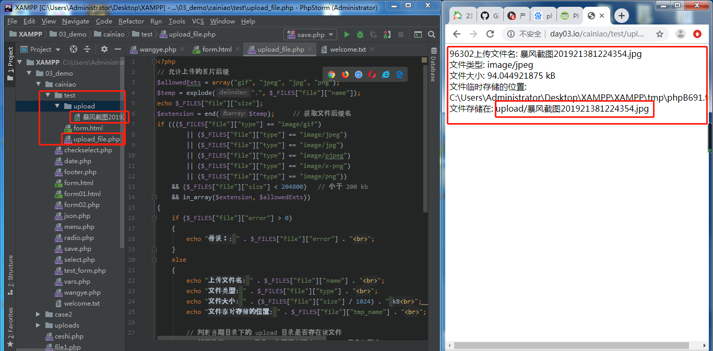

# 第05节:文件上传
上一节我们介绍了文件打开、关闭的文件方法和读取文件的多种方式，本节我们来讲如何通过HTML表单元素把文件上传以及上传时的注意事项

### 一、学习目标
怎样通过一个简单的HTML表单元素将文件上传到服务器上并加以处理以及上传时候的大小及规范，如何将临时文件保存到想要的所需目录下

### 二、PHP 文件上传

本节实例在 test 项目下完成，目录结构为：[代码案例](https://github.com/xiaozhoulee/php_example/tree/master/%E7%AC%AC04%E7%AB%A0%EF%BC%9Aphp%E8%BF%9B%E9%98%B6/%E7%AC%AC05%E8%8A%82%EF%BC%9A%E4%B8%8A%E4%BC%A0%E6%96%87%E4%BB%B6/demo01)

``` php
test                     # 文件夹名称
|-----upload             # 文件上传的目录
|-----form.html          # 表单文件
|-----upload_file.php    # php 上传代码
```

#### 1.创建一个文件上传表单

允许用户从表单上传文件是非常有用的

请看下面这个供上传文件的 HTML 表单：

实例代码如下:

``` php
<html>
<head>
<meta charset="utf-8">
<title>晓舟报告(xiaozhoubg.com)</title>
</head>
<body>

<form action="upload_file.php" method="post" enctype="multipart/form-data">
    <label for="file">文件名：</label>
    <input type="file" name="file" id="file"><br>
    <input type="submit" name="submit" value="提交">
</form>

</body>
</html>
```

将以上代码保存到 form.html 文件中。

有关上面的 HTML 表单的一些注意项列举如下：

* \<form> 标签的 enctype 属性规定了在提交表单时要使用哪种内容类型。在表单需要二进制数据时，比如文件内容，请使用 "multipart/form-data"
* \<input> 标签的 type="file" 属性规定了应该把输入作为文件来处理。举例来说，当在浏览器中预览时，会看到输入框旁边有一个浏览按钮。

注意：允许用户上传文件是一个巨大的安全风险。请仅仅允许可信的用户执行文件上传操作。

#### 2.创建上传脚本

"upload_file.php" 文件含有供上传文件的代码：

实例代码如下:

``` php
<?php
if ($_FILES["file"]["error"] > 0)
{
    echo "错误：" . $_FILES["file"]["error"] . "<br>";
}
else
{
    echo "上传文件名: " . $_FILES["file"]["name"] . "<br>";
    echo "文件类型: " . $_FILES["file"]["type"] . "<br>";
    echo "文件大小: " . ($_FILES["file"]["size"] / 1024) . " kB<br>";
    echo "文件临时存储的位置: " . $_FILES["file"]["tmp_name"];
}
?>
```

通过$_FILES来接受文件上传的数据，判断文件上传的错误信息是否大于0，如果大于0则输出这个报错信息反之执行else里面的内容：

第一个参数是表单的 input name，第二个下标可以是 "name"、"type"、"size"、"tmp_name" 或 "error"。如下所示：

* $_FILES["file"]["name"] - 上传文件的名称
* $_FILES["file"]["type"] - 上传文件的类型
* $_FILES["file"]["size"] - 上传文件的大小，以字节计算
* $_FILES["file"]["tmp_name"] - 存储在服务器的文件的临时副本的名称
* $_FILES["file"]["error"] - 由文件上传导致的错误代码

这是一种非常简单文件上传方式。基于安全方面的考虑，您应当增加有关允许哪些用户上传文件的限制

#### 3.上传限制

在这个脚本中，我们增加了对文件上传的限制。用户只能上传 .gif、.jpeg、.jpg、.png 格式的文件 并且 文件大小必须小于 200 kB

实例代码如下:

``` php
<?php
// 允许上传的图片后缀
$allowedExts = array("gif", "jpeg", "jpg", "png");
$temp = explode(".", $_FILES["file"]["name"]);
$extension = end($temp);        // 获取文件后缀名
if ((($_FILES["file"]["type"] == "image/gif")
|| ($_FILES["file"]["type"] == "image/jpeg")
|| ($_FILES["file"]["type"] == "image/jpg")
|| ($_FILES["file"]["type"] == "image/pjpeg")
|| ($_FILES["file"]["type"] == "image/x-png")
|| ($_FILES["file"]["type"] == "image/png"))
&& ($_FILES["file"]["size"] < 204800)    // 小于 200 kb
&& in_array($extension, $allowedExts))
{
    if ($_FILES["file"]["error"] > 0)
    {
        echo "错误：: " . $_FILES["file"]["error"] . "<br>";
    }
    else
    {
        echo "上传文件名: " . $_FILES["file"]["name"] . "<br>";
        echo "文件类型: " . $_FILES["file"]["type"] . "<br>";
        echo "文件大小: " . ($_FILES["file"]["size"] / 1024) . " kB<br>";
        echo "文件临时存储的位置: " . $_FILES["file"]["tmp_name"];
    }
}
else
{
    echo "非法的文件格式";
}
?>
```

我们把允许上传的四种文件格式放进数组中传入到\$allowedExts变量中，通过explode()函数把文件传输过来的name字符串以数组形式传入到\$temp变量中，使用end()函数判断\$temp的后缀名，判断如果用户传输的type类型是否是以上几种类型，或者文件大小小于200kb，以及通过in_array()函数验证$extension、$allowedExts是否是数组，以上条件都不是则输出非法的文件格式，如果成功则判断文件的错误信息是否大于0，大于0则输出报错信息，反之则输出此文件上传的相关信息

#### 4.保存被上传的文件

上面的实例在服务器的临时文件夹中，创建了一个被上传文件存储的临时副本。

这个临时的副本文件会在脚本结束时消失。要保存被上传的文件，我们需要把它拷贝到另外的位置

实例如下所示:

``` php
<?php
// 允许上传的图片后缀
$allowedExts = array("gif", "jpeg", "jpg", "png");
$temp = explode(".", $_FILES["file"]["name"]);
echo $_FILES["file"]["size"];
$extension = end($temp);     // 获取文件后缀名
if ((($_FILES["file"]["type"] == "image/gif")
|| ($_FILES["file"]["type"] == "image/jpeg")
|| ($_FILES["file"]["type"] == "image/jpg")
|| ($_FILES["file"]["type"] == "image/pjpeg")
|| ($_FILES["file"]["type"] == "image/x-png")
|| ($_FILES["file"]["type"] == "image/png"))
&& ($_FILES["file"]["size"] < 204800)   // 小于 200 kb
&& in_array($extension, $allowedExts))
{
    if ($_FILES["file"]["error"] > 0)
    {
        echo "错误：: " . $_FILES["file"]["error"] . "<br>";
    }
    else
    {
        echo "上传文件名: " . $_FILES["file"]["name"] . "<br>";
        echo "文件类型: " . $_FILES["file"]["type"] . "<br>";
        echo "文件大小: " . ($_FILES["file"]["size"] / 1024) . " kB<br>";
        echo "文件临时存储的位置: " . $_FILES["file"]["tmp_name"] . "<br>";
        
        // 判断当前目录下的 upload 目录是否存在该文件
        // 如果没有 upload 目录，你需要创建它
        if (file_exists("upload/" . $_FILES["file"]["name"]))
        {
            echo $_FILES["file"]["name"] . " 文件已经存在。 ";
        }
        else
        {
            // 如果 upload 目录存在该文件则将图片上传到 upload 目录下
            move_uploaded_file($_FILES["file"]["tmp_name"], "upload/" . $_FILES["file"]["name"]);
            echo "文件存储在: " . "upload/" . $_FILES["file"]["name"];
        }
    }
}
else
{
    echo "非法的文件格式";
}
?>
```

和上面上传限制案例类似，唯一不同的是多了一个if()判断，判断的是临时文件如何保存到另外位置的相关代码

文件上传流程图如下所示：


客户端提交文件表单图片


服务端接受文件表单并处理逻辑把文件拷贝到upload文件下

### 三、总结

本节我们介绍了通过form表单来进行文件的提交，提交时需要规定提交格式及提交文件大小，以及上传时会把文件存储到临时副本文件中 我们需要对其进行处理，以图片的形式介绍了客户端与服务单接发数据的流程

### 四、作业
* 熟悉文件上传交互的流程
* 手动书写代码案例，做到每个知识点都能理解的程度
* 客户端上传音乐文件并且加以限制大小不超过10M、只可以上传mp3的格式，服务端接受文件并打印音乐文件中的相关数据(类似上传图片文件)