# 第03节:URL和路由
上一节我们介绍了thinkphp项目搭建与相关目录介绍，本节我们来讲解通过URL来切换不同页面以及使用路由的方式来美化URL

### 一、学习目标
如何通过在URL中传入不同参数来跳转不同页面实现不同的效果以及理解怎么隐藏入口文件当中的URL的某些信息实现简写的效果，学习入口文件绑定的三种方法，和通过路由的方式美化URL、简化用户的访问信息

### 二、URL

#### 1.入口文件

1、单入口文件:应用程序的所有http请求都由某一个文件接受并由这个文件转发到功能代码中 【public/index.php 传入不同的参数跳转到不同的控制器执行不同的方法实现不同的功能】

2、优势:
* 只需要在入口文件做安全检测  多入口文件多次检测

* 在入口文件 过滤掉无效请求   多入口文件多次过滤

3、进入public/index.php 配置conf文件，里面存放用来配置整个项目的配置文件，如下图所示：

application下 自动创建的index/controller模块，index文件这个下可以放model、view、controller这三个模块。

在根目录创建conf文件夹用来存放这个项目的应用配置
注意：thinkphp这个项目里面有默认的配置，在其基础上修改会意想不到出现问题，这时候我们就会用到conf这个文件里面配置的内容替换掉项目默认配置文件当中的内容，实现想要的配置效果

4、如APP_PATH常量定义文件具体位置在 thinkphp/base.php 如图所示：

5、加载引导文件具体位置在 thinkphp/start.php (安全检测 处理无效请求等) 如下图所示：
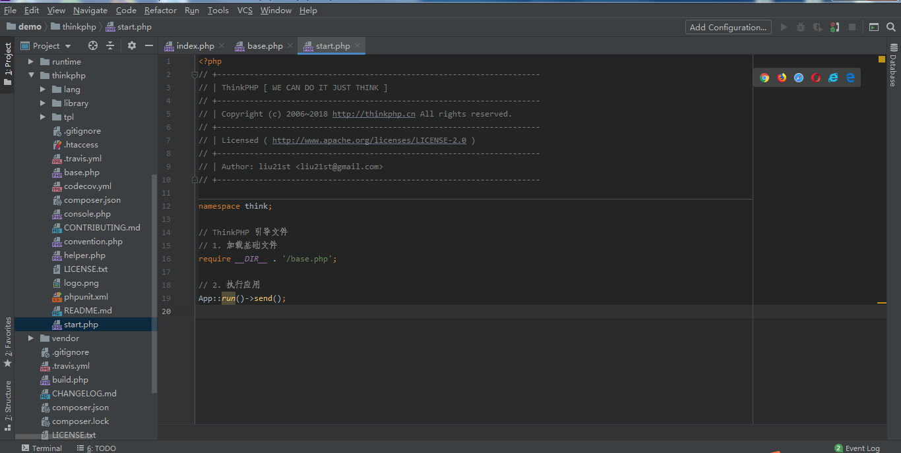

入口文件总结：入口文件 可以改变系统默认配置(常量配置) 加载引导文件start.php

#### 2.隐藏入口文件

1、将项目根目录设置为public下面的index.php这个文件 http://localhost访问的是public/index.php

效果相当于 http://localhost/index.php

2、但是访问其他模块 需要http://localhost/index.php/admin/... 修改apache配置文件httpd.conf
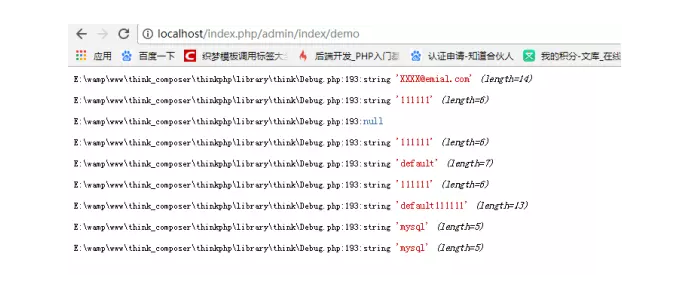

1.打开apache目录下的httpd.conf文件
2.找到'<Directory "C:/Users/Administrator/Desktop/XAMPP/demo/public">'设置路径为根目录下的public
3.重启Apache
4.访问其他模块 即便不输入index.php 也可以访问当前路径的文件 localhost/admin/...
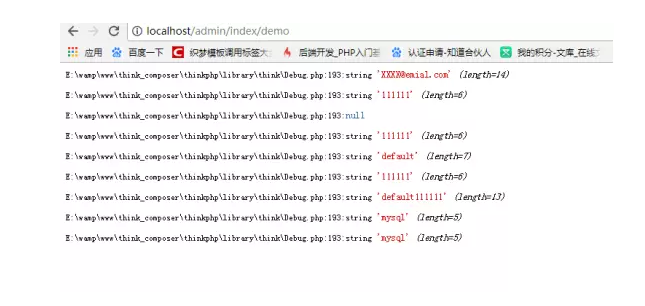

3、此处 默认读取了 在public/.htaccess 这个文件定义重写规则，如下图所示：
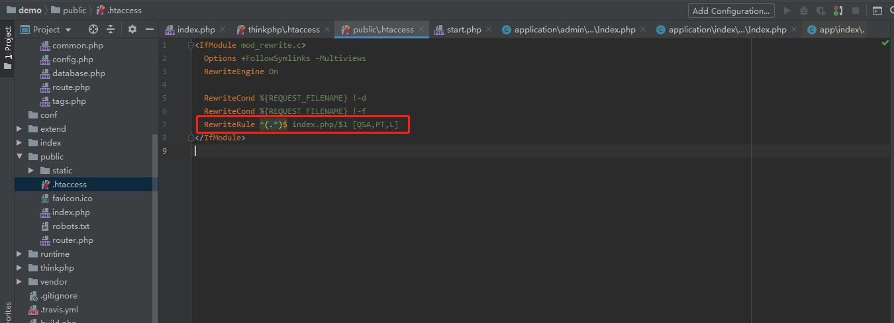

此条规则的定义是：把当前所有请求，重定向到index.php/$1指的是 我们要访问的admin/..路径

4、在apache修改上述配置后 读取此文件
若此文件存在则启用此规则 隐藏掉index.php入口文件 http://localhost/admin/index/demo

若此文件不存在 访问的时候必须加上index.php http://localhost/index.php/admin/index/demo

#### 3.入口文件的绑定
1、概念：index.php默认访问的是index模块下index控制器的index方法

2、默认文件地址是：public/index.php 
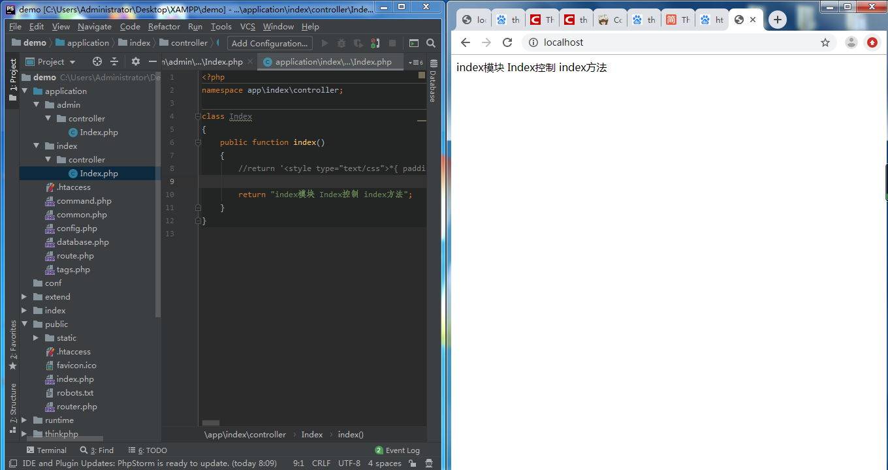

此默认地址对应的文件是：application/index/controller/Index.php下面的index这个方法

3、方法一: 修改public/index.php

1.入口文件绑定 define('BIND_MODULE','admin') ; 此处绑定的是admin控制器 也可以admin/index 访问的时候 localhost/index 直接到index控制器下的方法(用于比较简单 模块少 页面少的网站)
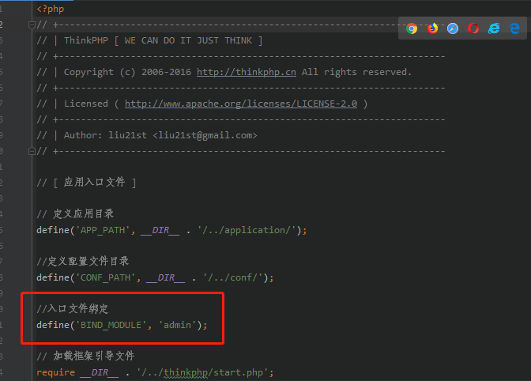

绑定到application文件下admin模块下Index控制器index方法,此时页面应该输出404，我们接下来要创建绑定的这个模块

2.新建admin模块Index控制器index方法
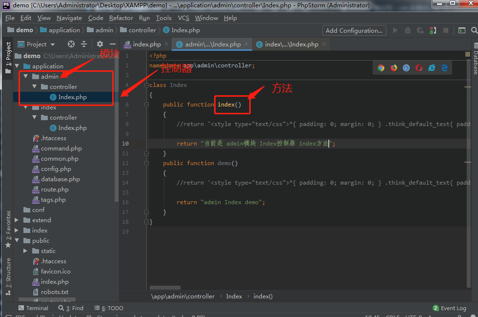

3.localhost测试
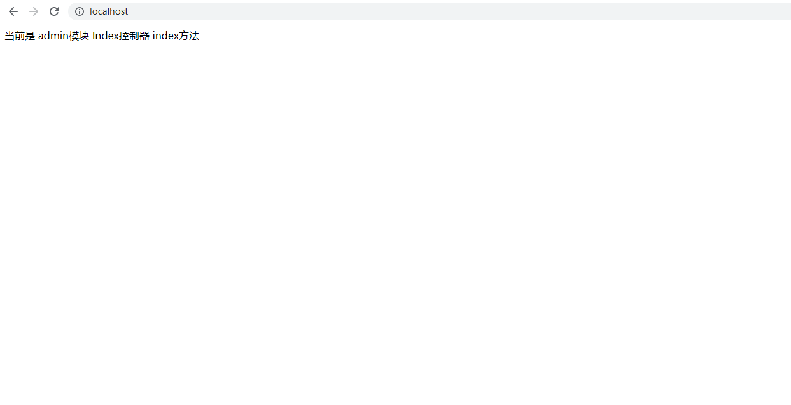

4.上述是绑定到了admin模块 访问admin下其他控制器 其他方法

a)index控制器下的demo方法

b)User控制器下的index方法
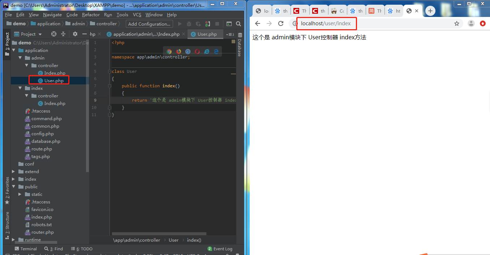

4、方法二: 如果当前网站需要给第三方提供数据 需要第三方通过接口只能访问到特定的模块 所以不希望第三方直接访问到index.php 而是特定的入口文件 如：api.php

1.新增public/api.php
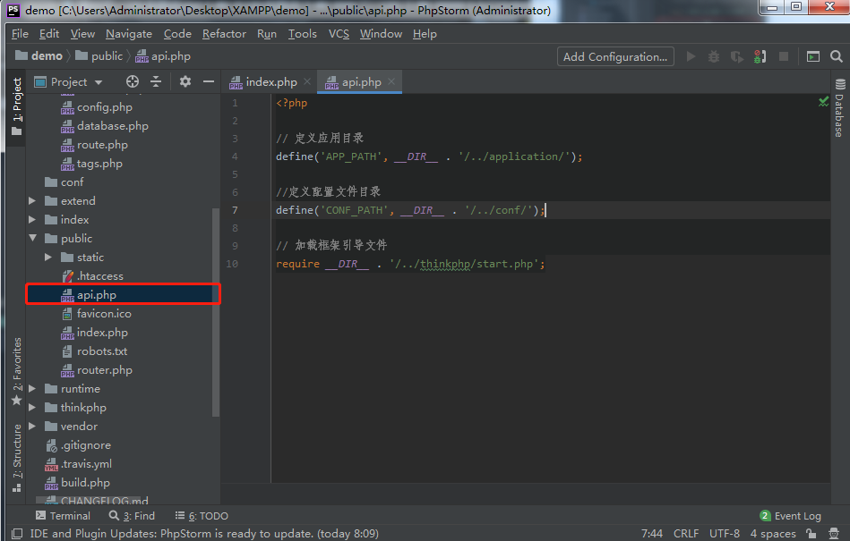

在目录public下创建文件夹api.php文件填写上面配置内容

2.localhost/api.php 访问 (默认访问的也是index模块下index控制器的index方法)

3.只希望通过api.php入口访问特定的模块 只能访问api模块

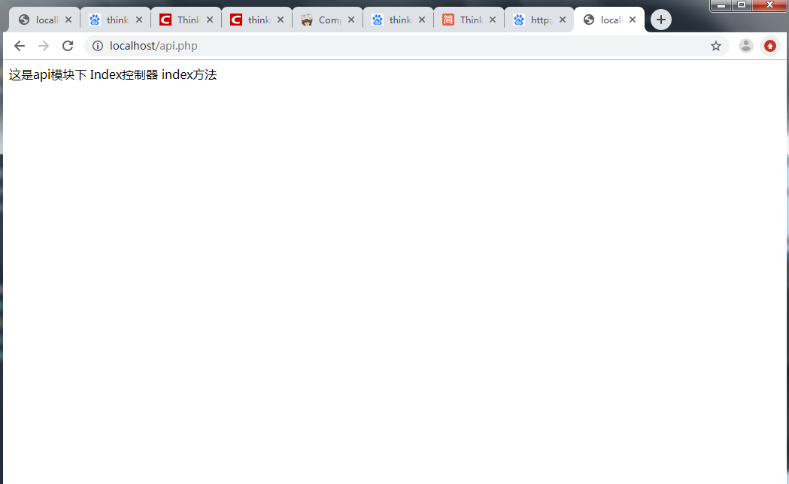

这时候我们就拦截了默认模块index将其改为api模块下的Index控制器里面index这个方法并显示执行的代码效果，注意：把api这个模块定义在application这个文件下

5、方法三:自动绑定

1.thinkphp/convention.php 下 'auto_bind_module' => false

thinkphp/convention.php是这个项目的默认配置文件

2.应用配置conf/config.php 开启入口自动绑定模块

将配置'auto_bind_module' => false,后面的属性改为true

在咱们之前新建的conf文件夹中创建config.php文件，在里面填写内容，把'auto_bind_module' => false这个属性的值改为true，注意：这里我们在conf文件夹里面新建的config.php文件为配置默认文件会自动应用

3.测试localhost | localhost/api.php | localhost/index/demo

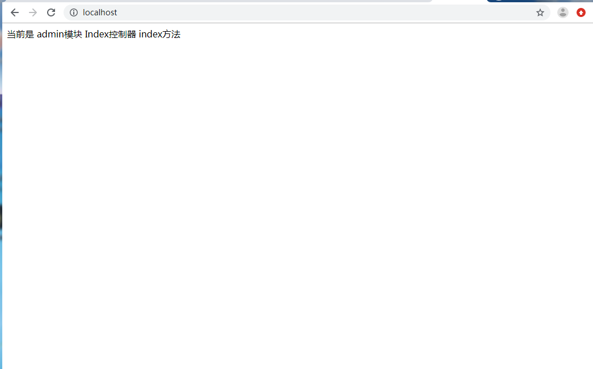
localhost测试

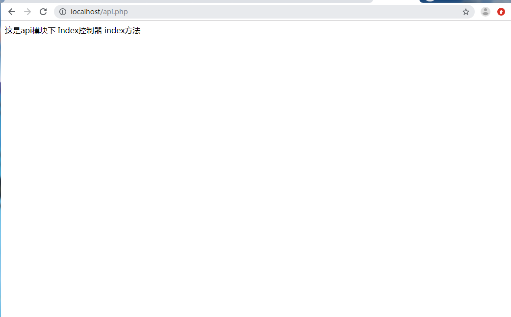
localhost/api.php测试

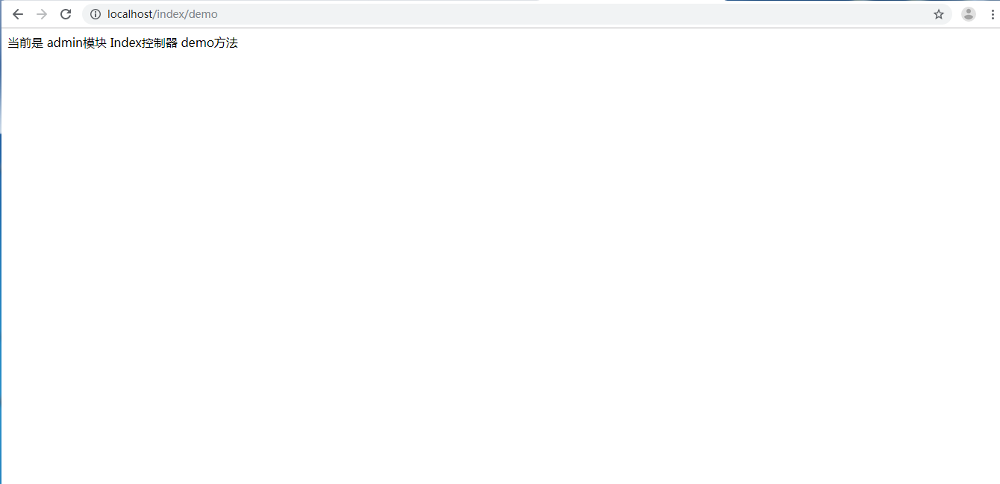
localhost/index/demo测试

4.总结:自动绑定的是和入口文件名相同的模块 (index.php ->index模块 api.php->api模块)

### 三、路由
路由的作用是：美化URL把用户访问简单化

正常访问是：localhost/模块名/控制器名/方法名

1、admin模块 User控制器 add方法

2、测试访问localhost/user/add/name/张三
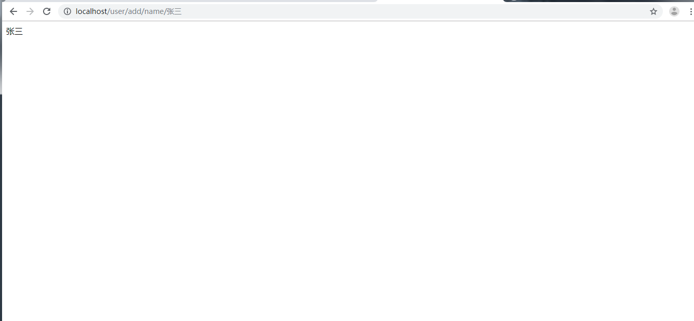

3、访问繁琐 用路由简化

1.配置文件(thinkphp/convention.php )中开启路由
'url_route_on' => true,  'url_route_must' => false,这两条配置
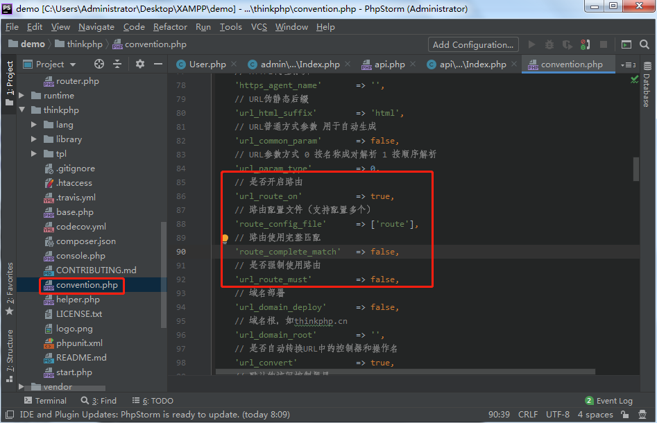

2.在应用配置文件conf/config.php 增加配置
'url_route_on' => true ,'url_route_must' => false,
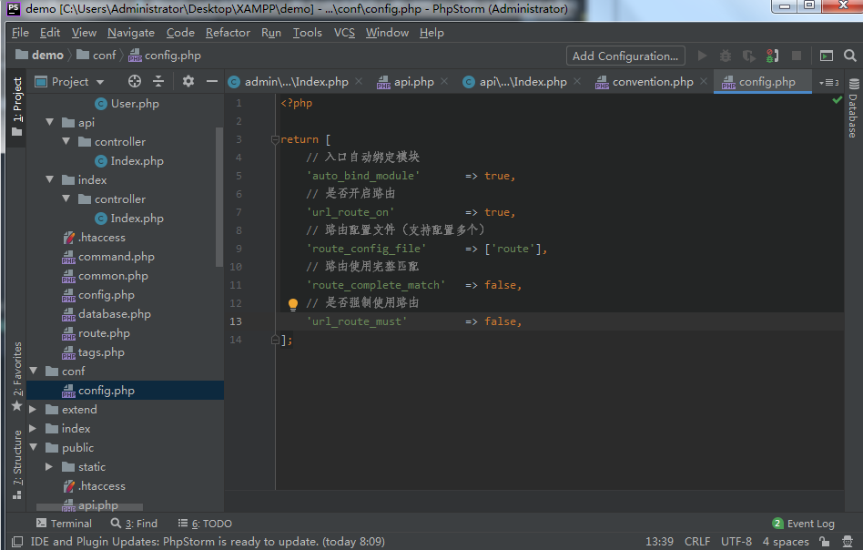

3.新建路由文件conf/route.php
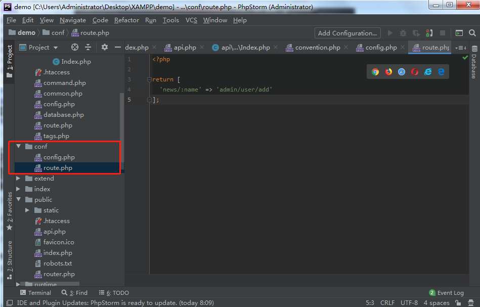
'news/:name'表示：地址栏，localhost/news/参数，'admin/user/add'表示：访问的是admin模块User控制器下的add方法

4.分别测试访问

localhost/news/张三 | localhost/admin/user/add/name/张三

测试localhost/news/张三

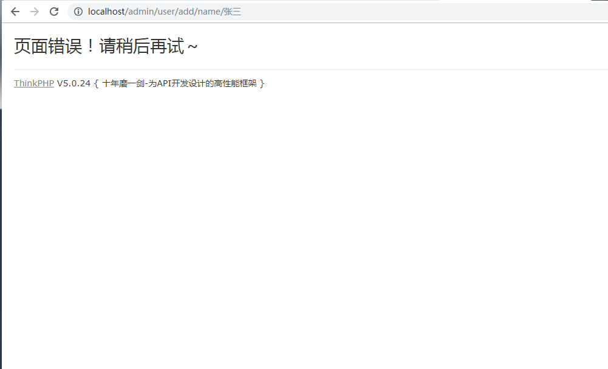
测试localhost/admin/user/add/name/张三

5.修改add方法 url()函数获取路径
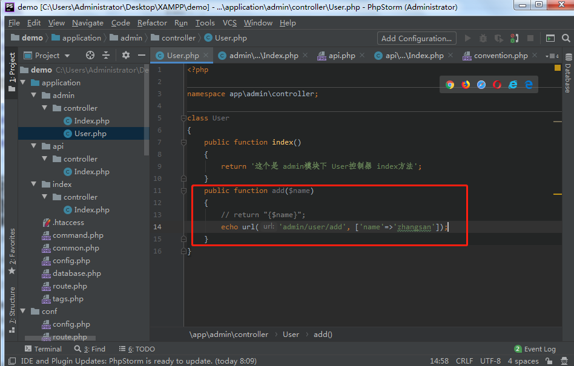
上面是通过url()这个函数来获取当前地址的路径

6.目前如果访问其他方法 还是可以访问的

7.让所有的请求全部强使用路由  配置conf/config.php这个文件下的内容
'url_route_must' => true,把原先这个属性的值改为true，允许使用

再次访问http://localhost/index/index/index 是拒绝访问的，默认的访问规则失效了
注意：开发中可以设置为false 按当前需要而定

本节我们学习了通过在浏览器输入参数来进行跳转不同页面实现不同效果，以及修改Apache根目录地址来隐藏入口文件，和入口文件绑定的三种方式，通过开启路由配置来进行URL的美化让用户输入体验更佳

### 四、作业
* 1.创建demo模块、Index控制器、index方法，转到此页面中输出我是demo模块、Index控制器、index方法
* 2.通过路由美化demo模块，使其变得更简洁
* 3.把api模块通过入口文件绑定的方式设置为起始页面，防止模块信息泄露