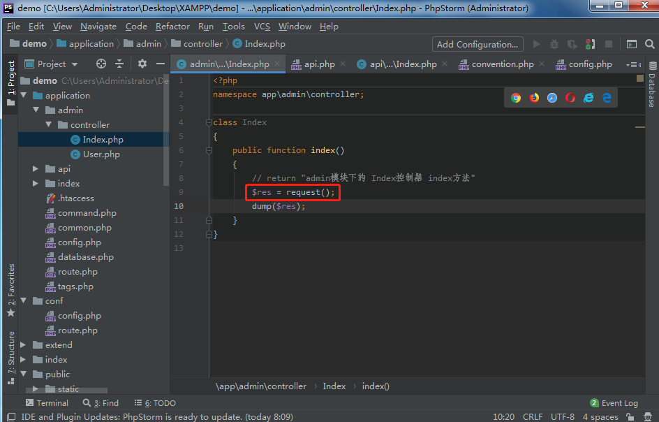
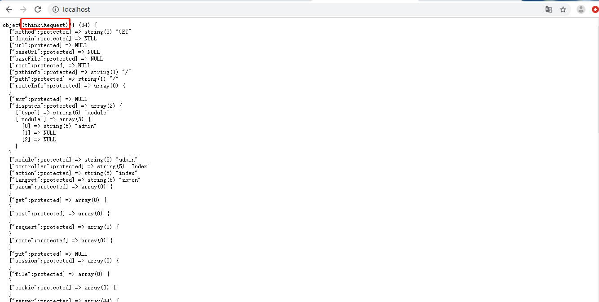
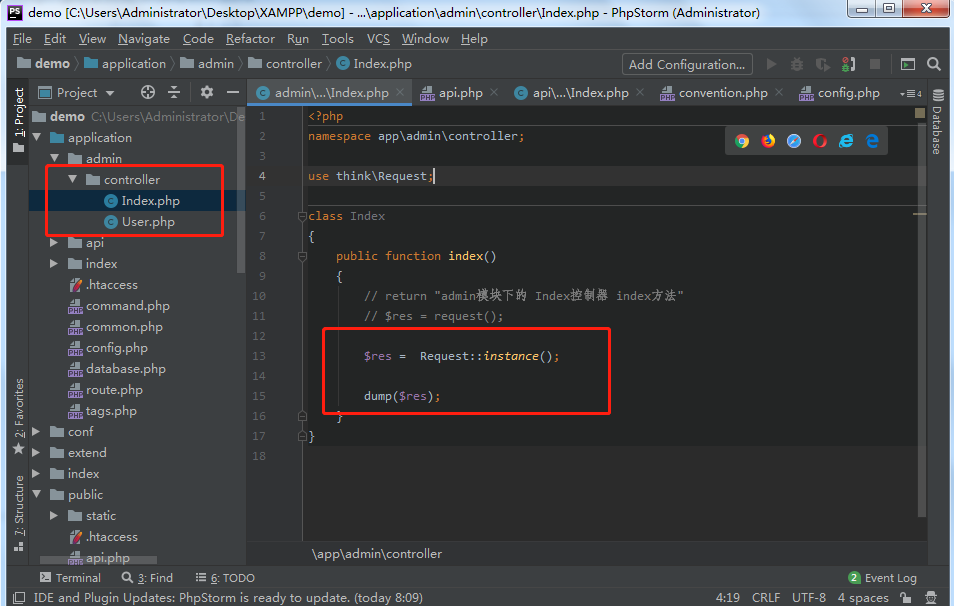
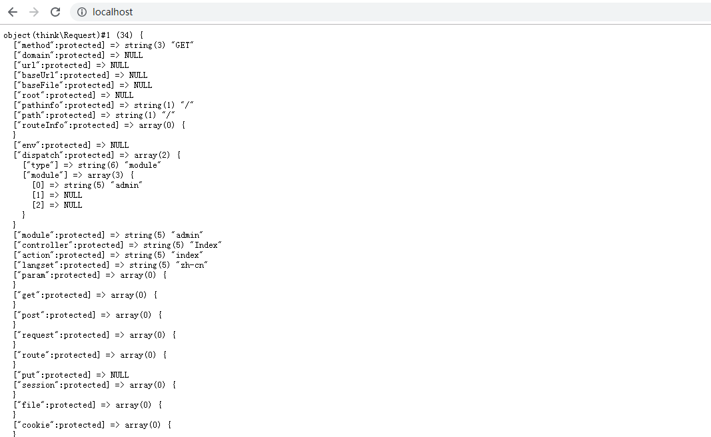
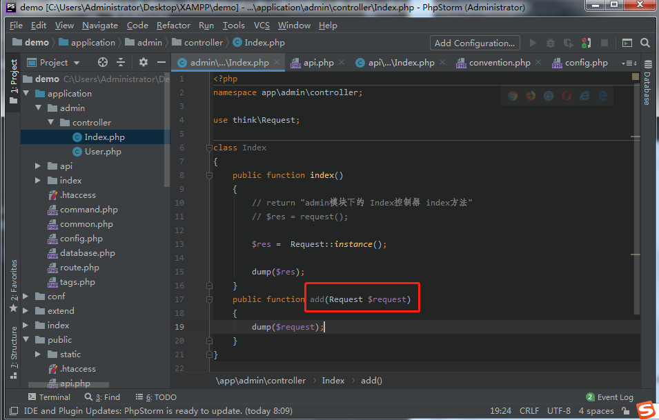
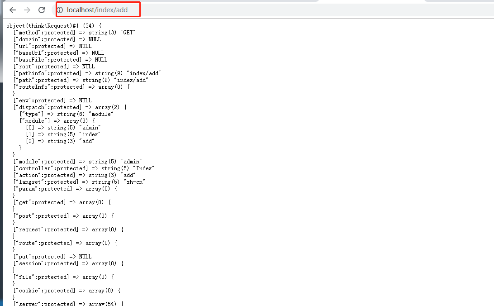
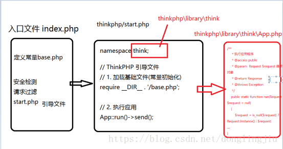
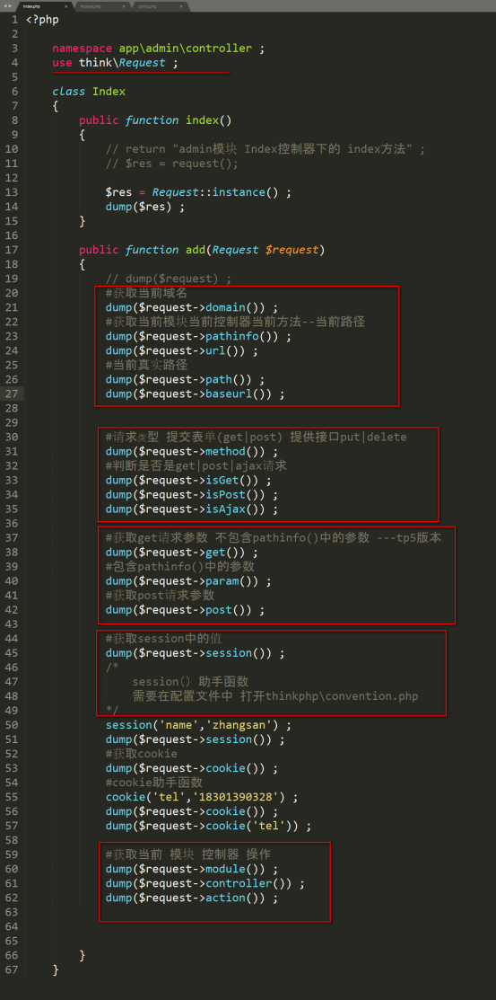
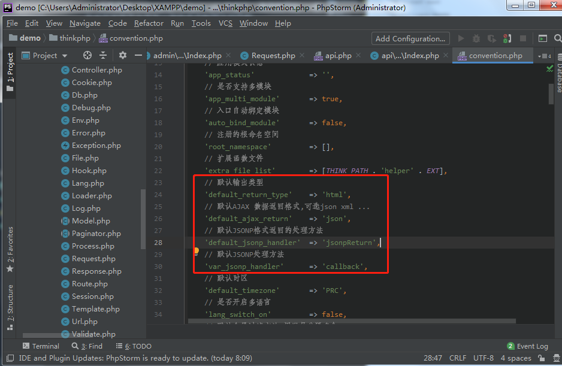
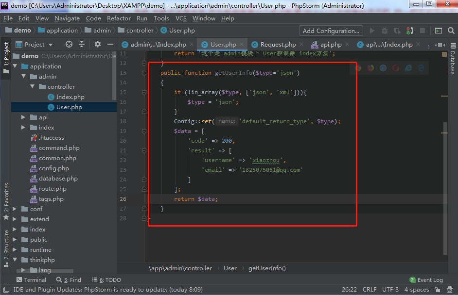

# 第04节:请求和响应
上一节我们将讲解了URL的使用方式以及如何通过路由来美化URL，本节我们介绍thinkphp的多种获取请求对象的方法,以及根据不同情况返回相应的数据格式

### 一、学习目标
通过哪三种方式来获取request对象，他们的注意事项和特殊配置，以及请求对象的参数是如何获取的，和接收到特定的请求后如何返回相应的数据格式

### 二、请求对象Request
1、单入口public/index.php  此文件接收http请求 请求中的所有参数都可以通过Request对象接收、处理

2、三种获取request对象的方法
1.助手函数request()

2.use think\Request ; Request是单例模式 通过Request::instance() ;获取对象

3.方法传参 request对象 ---public function index(Request $request){}【推荐使用】

3、请求对象参数获取

1.请求对象的定义 App::run()

请求对象获取参数的流程

2.Request类定义的多种方法，如下所示：

具体方法详情请参见 thinkphp\library\think\Request.php这个文件

### 三、响应对象Response
1.为app开发接口 响应对象可能是json|XML

2.ajax请求  响应对象可能是json|jsonp|xml|html

3.企业官网 可能返回html就可以了

4.tp5不建议在控制器中  echo...  die()操作  控制器最终会返回一个值 这个值需要在response对象中处理  推荐return dump($res) 或者 return ‘123’ ...

5.Thinkphp\convention.php 配置默认输出对象
'default_return_type'    => 'html', |json|xml...

注意：这里配置时，按所需配置

6.一般会传入参数 判断返回值类型 然后根据需要动态修改配置(在入口文件或者构造函数 统一规定返回类型)

模拟一个json返回格式的数组

in_array($type, ['json', 'xml'])：判断参数是否为一个数组并且这个数组的返回格式是json或者xml，如果不为这两个其中的一个，让其转换为json格式

Config::set('default_return_type', \$type)：让其默认返回类型为$type。

$data[]：存放数据，如果成功后则输出里面的内容

本节我们学习了三种不同获取request对象的方法，以及获取请求对象参数，根据不同情况返回相应的数据格式，注意：在以后通过thinkphp框架做项目时，尽量使用public function index(Request $request){}这种方式获取request对象，这种方法理解起来较为简单且方法体里面的代码会显得更加简洁一些

### 四、作业
* 了解本节内容里面相关配置文件中的内容
* 对获取对象的Request类定义的多种方法进行多次编写，加深印象
* 理解thinkphp框架的请求方式与响应方式