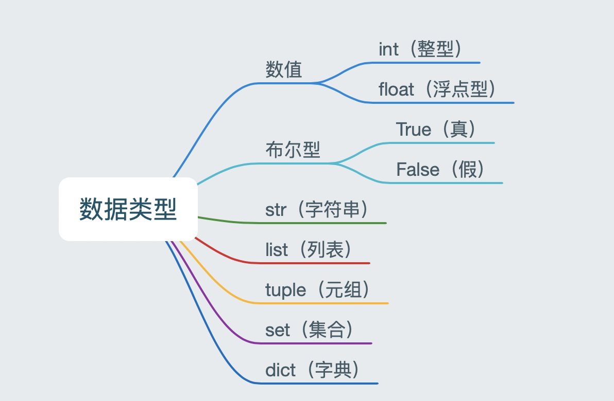

# 第03节：基本数据类型

本章我们来简单认识一下数据类型都有哪些，后续章节会有详细的讲解 
### 一、数据类型简介  
在python中为了应对不同的业务需求，也把数据分为了不同的类型。    
  

本章我大家给简单介绍一下数值、布尔型和字符串
### 二、数值（整数型和浮点型）
1、整数型：  
``` python
Python可以处理任意大小的整数，当然包括负整数，在程序中的表示方法和数学上的写法一模一样，例如：
1，100，-8080，0，等等。
```  
2、浮点型：  
``` python
浮点数等同于小数，他们是一个东西。浮点数可以用数学写法，如1.23，3.14，-9.01，等等。
但是对于很大或很小的浮点数，必须用科学计数法表示，把10用e替代，1.23x109就是1.23e9，
或者12.3e8，0.000012可以写成1.2e-5，等等。
```  
### 三、布尔型
布尔值和布尔代数的表示完全一致，一个布尔值只有True、False两种值，要么是True，要么是False，在Python中，可以直接用True、False表示布尔值（请注意大小写），也可以通过布尔运算计算出来：  
``` python
True
print(True)  # True
False
print(False) # False
a = 3>2
print(a) # True
b = 3<2
print(b) # False
```
### 四、字符串
字符串是以单引号'或双引号"括起来的任意文本，比如'abc'，"xyz"等等。请注意，''或""本身只是一种表示方式，不是字符串的一部分，因此，字符串'abc'只有a，b，c这3个字符。如果'本身也是一个字符，那就可以用""括起来，比如"I'm OK"包含的字符是I，'，m，空格，O，K这6个字符。  
如果字符串内部既包含'又包含"怎么办？可以用转义字符\来标识，比如：  
``` python
print('I\'m \"OK\"!')
# 表示的内容是
I'm "OK"!
```
### 五、type()函数
python内置的 type() 函数可以用来查询变量所指的对象类型。  
实例:
``` python
a = 1   
print(type(1))
# 输出结果为 <class 'int'> 意思是a为int整数类型
```
### 六、验证数据类型
``` python
# 1、int —— 整数型
num1 = 1
print(type(num1)) # <class 'int'>

# 2、float —— 浮点型（小数）
num2 = 1.1
print(type(num2)) # <class 'float'>

# 3、str —— 字符串  特点：一定要带引号
a = "hello word"
print(type(a)) # <class 'str'>

# 4、bool —— 布尔型，一般在判断时使用，布尔型有两个取值 True(真)和False(假)
b = True
print(type(b)) # <class 'bool'>

# 5、list —— 列表
c = [10,20,30]
print(type(c)) # <class 'list'>

# 6、tuple —— 元组
d = (10,20,30)
print(type(d)) # <class 'tuple'>

# 7、set —— 集合
e = {10,20,30}
print(type(e)) # <class 'set'>

# 8、dict —— 字典 —— 键值对
f = {"name":"TOM","age":18}
print(type(f)) # <class 'dict'>
``` 
### 七、本章总结
通过本章的学习我们知道了基本数据类型都有哪些，和如何验证不同的数据到底是什么数据类型。本章节只是介绍了一些数据类型的基本概念，后续章节会有更加详细的讲解。


